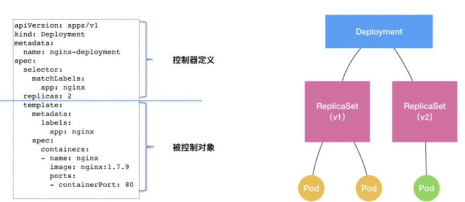
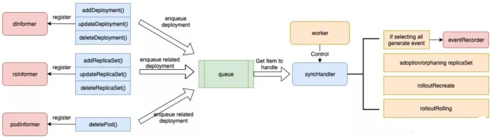

# controller机制介绍
>> 以Deployment controller为例，介绍8s ontroller是如何实现的。

deployment controller是kube-controller-manager组件中众多控制器中的一个，是deployment资源对象的控制器，其通过对deployment、replicaset、pod三种资源的监听，当三种资源发生变化时会触发对相应的deployment资源进行调谐操作，从而完成deployment的扩缩容、暂停恢复、更新、回滚、状态status更新、所属的旧replicaset清理等操作。




K8S的Controller模式，经常是顶层资源通过控制下层资源，来拓展新能力。deployment并没有直接对pod进行管理，是通过管理ReplicaSet对Pod的副本控制。deployment通过对ReplicaSet的控制实现了版本管理：
- 每次发布对应一个版本，每个版本有一个ReplicaSet，在注解中标识版本号
- ReplicaSet再根据pod template和副本数运行相应的pod。

deployment的本质是控制replicaSet，replicaSet会控制pod，然后由controller驱动各个对象达到期望状态。

## Deployment Controller

代码来自https://github.com/kubernetes/kubernetes/blob/master/pkg/controller/deployment/deployment_controller.go
```diff
// DeploymentController is responsible for synchronizing Deployment objects stored
// in the system with actual running replica sets and pods.
type DeploymentController struct {
	// rsControl is used for adopting/releasing replica sets.
	rsControl     controller.RSControlInterface
	client        clientset.Interface
	eventRecorder record.EventRecorder

	// To allow injection of syncDeployment for testing.
	syncHandler func(ctx context.Context, dKey string) error
	// used for unit testing
	enqueueDeployment func(deployment *apps.Deployment)

	// dLister can list/get deployments from the shared informer's store
	dLister appslisters.DeploymentLister
	// rsLister can list/get replica sets from the shared informer's store
	rsLister appslisters.ReplicaSetLister
	// podLister can list/get pods from the shared informer's store
	podLister corelisters.PodLister

	// dListerSynced returns true if the Deployment store has been synced at least once.
	// Added as a member to the struct to allow injection for testing.
	dListerSynced cache.InformerSynced
	// rsListerSynced returns true if the ReplicaSet store has been synced at least once.
	// Added as a member to the struct to allow injection for testing.
	rsListerSynced cache.InformerSynced
	// podListerSynced returns true if the pod store has been synced at least once.
	// Added as a member to the struct to allow injection for testing.
	podListerSynced cache.InformerSynced

	// Deployments that need to be synced
	queue workqueue.RateLimitingInterface
}

// NewDeploymentController creates a new DeploymentController.
func NewDeploymentController(dInformer appsinformers.DeploymentInformer, rsInformer appsinformers.ReplicaSetInformer, podInformer coreinformers.PodInformer, client clientset.Interface) (*DeploymentController, error) {
	eventBroadcaster := record.NewBroadcaster()
	eventBroadcaster.StartStructuredLogging(0)
	eventBroadcaster.StartRecordingToSink(&v1core.EventSinkImpl{Interface: client.CoreV1().Events("")})

	if client != nil && client.CoreV1().RESTClient().GetRateLimiter() != nil {
		if err := ratelimiter.RegisterMetricAndTrackRateLimiterUsage("deployment_controller", client.CoreV1().RESTClient().GetRateLimiter()); err != nil {
			return nil, err
		}
	}
	dc := &DeploymentController{
		client:        client,
		eventRecorder: eventBroadcaster.NewRecorder(scheme.Scheme, v1.EventSource{Component: "deployment-controller"}),
		queue:         workqueue.NewNamedRateLimitingQueue(workqueue.DefaultControllerRateLimiter(), "deployment"),
	}
	dc.rsControl = controller.RealRSControl{
		KubeClient: client,
		Recorder:   dc.eventRecorder,
	}

+	// deployment的EventHandler
	dInformer.Informer().AddEventHandler(cache.ResourceEventHandlerFuncs{
		AddFunc:    dc.addDeployment,
		UpdateFunc: dc.updateDeployment,
		// This will enter the sync loop and no-op, because the deployment has been deleted from the store.
		DeleteFunc: dc.deleteDeployment,
	})
+	// replicaset的EventHandler	
	rsInformer.Informer().AddEventHandler(cache.ResourceEventHandlerFuncs{
		AddFunc:    dc.addReplicaSet,
		UpdateFunc: dc.updateReplicaSet,
		DeleteFunc: dc.deleteReplicaSet,
	})
+	// pod的EventHandler	
	podInformer.Informer().AddEventHandler(cache.ResourceEventHandlerFuncs{
		DeleteFunc: dc.deletePod,
	})

	dc.syncHandler = dc.syncDeployment
	dc.enqueueDeployment = dc.enqueue

	dc.dLister = dInformer.Lister()
	dc.rsLister = rsInformer.Lister()
	dc.podLister = podInformer.Lister()
	dc.dListerSynced = dInformer.Informer().HasSynced
	dc.rsListerSynced = rsInformer.Informer().HasSynced
	dc.podListerSynced = podInformer.Informer().HasSynced
	return dc, nil
}
```

- EventHandler

三种EventHandler，分别对应Deployment，ReplicaSet和Pod

1. Deployment的EventHandler
```diff
func (dc *DeploymentController) addDeployment(obj interface{}) {
	d := obj.(*apps.Deployment)
	klog.V(4).InfoS("Adding deployment", "deployment", klog.KObj(d))
	dc.enqueueDeployment(d)
}

func (dc *DeploymentController) updateDeployment(old, cur interface{}) {
	oldD := old.(*apps.Deployment)
	curD := cur.(*apps.Deployment)
	klog.V(4).InfoS("Updating deployment", "deployment", klog.KObj(oldD))
	dc.enqueueDeployment(curD)
}

func (dc *DeploymentController) deleteDeployment(obj interface{}) {
	d, ok := obj.(*apps.Deployment)
	klog.V(4).InfoS("Deleting deployment", "deployment", klog.KObj(d))
	dc.enqueueDeployment(d)
}

+ // dc.enqueueDeployment = dc.enqueue
func (dc *DeploymentController) enqueue(deployment *apps.Deployment) {
	key, err := controller.KeyFunc(deployment)
	if err != nil {
		utilruntime.HandleError(fmt.Errorf("couldn't get key for object %#v: %v", deployment, err))
		return
	}

	dc.queue.Add(key)
}
```
2. ReplicaSet的EventHandler
```diff
// addReplicaSet enqueues the deployment that manages a ReplicaSet when the ReplicaSet is created.
func (dc *DeploymentController) addReplicaSet(obj interface{}) {
	rs := obj.(*apps.ReplicaSet)

	if rs.DeletionTimestamp != nil {
		// On a restart of the controller manager, it's possible for an object to
		// show up in a state that is already pending deletion.
		dc.deleteReplicaSet(rs)
		return
	}

	// If it has a ControllerRef, that's all that matters.
	if controllerRef := metav1.GetControllerOf(rs); controllerRef != nil {
		d := dc.resolveControllerRef(rs.Namespace, controllerRef)
		if d == nil {
			return
		}
		klog.V(4).InfoS("ReplicaSet added", "replicaSet", klog.KObj(rs))
		dc.enqueueDeployment(d)
		return
	}

	// Otherwise, it's an orphan. Get a list of all matching Deployments and sync
	// them to see if anyone wants to adopt it.
	ds := dc.getDeploymentsForReplicaSet(rs)
	if len(ds) == 0 {
		return
	}
	klog.V(4).InfoS("Orphan ReplicaSet added", "replicaSet", klog.KObj(rs))
	for _, d := range ds {
		dc.enqueueDeployment(d)
	}
}

// getDeploymentsForReplicaSet returns a list of Deployments that potentially
// match a ReplicaSet.
func (dc *DeploymentController) getDeploymentsForReplicaSet(rs *apps.ReplicaSet) []*apps.Deployment {
	deployments, err := util.GetDeploymentsForReplicaSet(dc.dLister, rs)
	if err != nil || len(deployments) == 0 {
		return nil
	}
	// Because all ReplicaSet's belonging to a deployment should have a unique label key,
	// there should never be more than one deployment returned by the above method.
	// If that happens we should probably dynamically repair the situation by ultimately
	// trying to clean up one of the controllers, for now we just return the older one
	if len(deployments) > 1 {
		// ControllerRef will ensure we don't do anything crazy, but more than one
		// item in this list nevertheless constitutes user error.
		klog.V(4).InfoS("user error! more than one deployment is selecting replica set",
			"replicaSet", klog.KObj(rs), "labels", rs.Labels, "deployment", klog.KObj(deployments[0]))
	}
	return deployments
}

// updateReplicaSet figures out what deployment(s) manage a ReplicaSet when the ReplicaSet
// is updated and wake them up. If the anything of the ReplicaSets have changed, we need to
// awaken both the old and new deployments. old and cur must be *apps.ReplicaSet
// types.
func (dc *DeploymentController) updateReplicaSet(old, cur interface{}) {
	curRS := cur.(*apps.ReplicaSet)
	oldRS := old.(*apps.ReplicaSet)
	if curRS.ResourceVersion == oldRS.ResourceVersion {
		// Periodic resync will send update events for all known replica sets.
		// Two different versions of the same replica set will always have different RVs.
		return
	}

	curControllerRef := metav1.GetControllerOf(curRS)
	oldControllerRef := metav1.GetControllerOf(oldRS)
	controllerRefChanged := !reflect.DeepEqual(curControllerRef, oldControllerRef)
	if controllerRefChanged && oldControllerRef != nil {
		// The ControllerRef was changed. Sync the old controller, if any.
		if d := dc.resolveControllerRef(oldRS.Namespace, oldControllerRef); d != nil {
			dc.enqueueDeployment(d)
		}
	}

	// If it has a ControllerRef, that's all that matters.
	if curControllerRef != nil {
		d := dc.resolveControllerRef(curRS.Namespace, curControllerRef)
		klog.V(4).InfoS("ReplicaSet updated", "replicaSet", klog.KObj(curRS))
		dc.enqueueDeployment(d)
		return
	}

	// Otherwise, it's an orphan. If anything changed, sync matching controllers
	// to see if anyone wants to adopt it now.
	labelChanged := !reflect.DeepEqual(curRS.Labels, oldRS.Labels)
	if labelChanged || controllerRefChanged {
		ds := dc.getDeploymentsForReplicaSet(curRS)
		if len(ds) == 0 {
			return
		}
		klog.V(4).InfoS("Orphan ReplicaSet updated", "replicaSet", klog.KObj(curRS))
		for _, d := range ds {
			dc.enqueueDeployment(d)
		}
	}
}

// deleteReplicaSet enqueues the deployment that manages a ReplicaSet when
// the ReplicaSet is deleted. obj could be an *apps.ReplicaSet, or
// a DeletionFinalStateUnknown marker item.
func (dc *DeploymentController) deleteReplicaSet(obj interface{}) {
	rs, ok := obj.(*apps.ReplicaSet)

	controllerRef := metav1.GetControllerOf(rs)
	if controllerRef == nil {
		// No controller should care about orphans being deleted.
		return
	}
	d := dc.resolveControllerRef(rs.Namespace, controllerRef)
	klog.V(4).InfoS("ReplicaSet deleted", "replicaSet", klog.KObj(rs))
	dc.enqueueDeployment(d)
}

// resolveControllerRef returns the controller referenced by a ControllerRef,
// or nil if the ControllerRef could not be resolved to a matching controller
// of the correct Kind.
func (dc *DeploymentController) resolveControllerRef(namespace string, controllerRef *metav1.OwnerReference) *apps.Deployment {
	// We can't look up by UID, so look up by Name and then verify UID.
	// Don't even try to look up by Name if it's the wrong Kind.
	if controllerRef.Kind != controllerKind.Kind {
		return nil
	}
	d, err := dc.dLister.Deployments(namespace).Get(controllerRef.Name)
	if err != nil {
		return nil
	}
	if d.UID != controllerRef.UID {
		// The controller we found with this Name is not the same one that the
		// ControllerRef points to.
		return nil
	}
	return d
}
```

3. Pod的EventHandler，只注册了Delete一个接口函数

```diff
// deletePod will enqueue a Recreate Deployment once all of its pods have stopped running.
func (dc *DeploymentController) deletePod(obj interface{}) {
	pod, ok := obj.(*v1.Pod)

	// When a delete is dropped, the relist will notice a pod in the store not
	// in the list, leading to the insertion of a tombstone object which contains
	// the deleted key/value. Note that this value might be stale. If the Pod
	// changed labels the new deployment will not be woken up till the periodic resync.
	if !ok {
		tombstone, ok := obj.(cache.DeletedFinalStateUnknown)
		if !ok {
			utilruntime.HandleError(fmt.Errorf("couldn't get object from tombstone %#v", obj))
			return
		}
		pod, ok = tombstone.Obj.(*v1.Pod)
		if !ok {
			utilruntime.HandleError(fmt.Errorf("tombstone contained object that is not a pod %#v", obj))
			return
		}
	}
	klog.V(4).InfoS("Pod deleted", "pod", klog.KObj(pod))
	if d := dc.getDeploymentForPod(pod); d != nil && d.Spec.Strategy.Type == apps.RecreateDeploymentStrategyType {
		// Sync if this Deployment now has no more Pods.
		rsList, err := util.ListReplicaSets(d, util.RsListFromClient(dc.client.AppsV1()))
		if err != nil {
			return
		}
		podMap, err := dc.getPodMapForDeployment(d, rsList)
		if err != nil {
			return
		}
		numPods := 0
		for _, podList := range podMap {
			numPods += len(podList)
		}
		if numPods == 0 {
			dc.enqueueDeployment(d)
		}
	}
}
```


- Deployment Controller的创建

在kube-controller-manager里https://github.com/kubernetes/kubernetes/blob/master/cmd/kube-controller-manager/app/apps.go
```diff
func startDeploymentController(ctx context.Context, controllerContext ControllerContext) (controller.Interface, bool, error) {
+	// 调用上面的NewDeploymentController
	dc, err := deployment.NewDeploymentController(
		controllerContext.InformerFactory.Apps().V1().Deployments(),
		controllerContext.InformerFactory.Apps().V1().ReplicaSets(),
		controllerContext.InformerFactory.Core().V1().Pods(),
		controllerContext.ClientBuilder.ClientOrDie("deployment-controller"),
	)
+	// Deployment Controller投入执行	
	go dc.Run(ctx, int(controllerContext.ComponentConfig.DeploymentController.ConcurrentDeploymentSyncs))
	return nil, true, nil
}
```

- Deployment Controller的执行

通常套路就是起几个worker协程，每个协程从workqueue上获取item，用processNextWorkItem依次处理。
```diff
// Run begins watching and syncing.
func (dc *DeploymentController) Run(ctx context.Context, workers int) {
	defer utilruntime.HandleCrash()
	defer dc.queue.ShutDown()

	klog.InfoS("Starting controller", "controller", "deployment")
	defer klog.InfoS("Shutting down controller", "controller", "deployment")

	if !cache.WaitForNamedCacheSync("deployment", ctx.Done(), dc.dListerSynced, dc.rsListerSynced, dc.podListerSynced) {
		return
	}

	for i := 0; i < workers; i++ {
+		// 多协程执行dc.worker，来处理workqueue	
		go wait.UntilWithContext(ctx, dc.worker, time.Second)
	}

	<-ctx.Done()
}

// worker runs a worker thread that just dequeues items, processes them, and marks them done.
// It enforces that the syncHandler is never invoked concurrently with the same key.
func (dc *DeploymentController) worker(ctx context.Context) {
+	// 处理workqueue里每一条item
	for dc.processNextWorkItem(ctx) {
	}
}

func (dc *DeploymentController) processNextWorkItem(ctx context.Context) bool {
	key, quit := dc.queue.Get()
	if quit {
		return false
	}
	defer dc.queue.Done(key)

+	// 调用syncHandler, 前面dc.syncHandler = dc.syncDeployment
	err := dc.syncHandler(ctx, key.(string))
	dc.handleErr(err, key)

	return true
}
```

- syncDeployment处理workqueue的item，key作为参数传进来

操作的优先级为：delete > pause > rollback > scale > rollout

```diff
// syncDeployment will sync the deployment with the given key.
// This function is not meant to be invoked concurrently with the same key.
func (dc *DeploymentController) syncDeployment(ctx context.Context, key string) error {
	namespace, name, err := cache.SplitMetaNamespaceKey(key)

	startTime := time.Now()
	klog.V(4).InfoS("Started syncing deployment", "deployment", klog.KRef(namespace, name), "startTime", startTime)
	defer func() {
		klog.V(4).InfoS("Finished syncing deployment", "deployment", klog.KRef(namespace, name), "duration", time.Since(startTime))
	}()

	deployment, err := dc.dLister.Deployments(namespace).Get(name)

	// Deep-copy otherwise we are mutating our cache.
	// TODO: Deep-copy only when needed.
	d := deployment.DeepCopy()

	everything := metav1.LabelSelector{}
	if reflect.DeepEqual(d.Spec.Selector, &everything) {
		dc.eventRecorder.Eventf(d, v1.EventTypeWarning, "SelectingAll", "This deployment is selecting all pods. A non-empty selector is required.")
		if d.Status.ObservedGeneration < d.Generation {
			d.Status.ObservedGeneration = d.Generation
			dc.client.AppsV1().Deployments(d.Namespace).UpdateStatus(ctx, d, metav1.UpdateOptions{})
		}
		return nil
	}

+	// 对集群中与deployment对象相同命名空间下的所有replicaset对象做处理，若发现匹配但没有关联deployment的replicaset则
+	// 通过设置ownerReferences字段与deployment关联，
+	// 已关联但不匹配的则删除对应的ownerReferences，最后获取返回集群中与Deployment关联匹配的ReplicaSet对象列表；
	// List ReplicaSets owned by this Deployment, while reconciling ControllerRef
	// through adoption/orphaning.
	rsList, err := dc.getReplicaSetsForDeployment(ctx, d)


+	// 根据deployment对象的selector，获取当前deployment对象关联的pod，根据deployment所属的replicaset对象的UID对pod进行
+	// 分类并返回，返回值类型为map[types.UID][]*v1.Pod；
	// List all Pods owned by this Deployment, grouped by their ReplicaSet.
	// Current uses of the podMap are:
	//
	// * check if a Pod is labeled correctly with the pod-template-hash label.
	// * check that no old Pods are running in the middle of Recreate Deployments.
	podMap, err := dc.getPodMapForDeployment(d, rsList)

+	// 检查是否是删除
	if d.DeletionTimestamp != nil {
		return dc.syncStatusOnly(ctx, d, rsList)
	}

+	// 检查deployment是否为pause状态
	// Update deployment conditions with an Unknown condition when pausing/resuming
	// a deployment. In this way, we can be sure that we won't timeout when a user
	// resumes a Deployment with a set progressDeadlineSeconds.
	dc.checkPausedConditions(ctx, d)
	if d.Spec.Paused {
		return dc.sync(ctx, d, rsList)
	}

+	// 检查deployment对象的annotations中是否有以下key：deprecated.deployment.rollback.to
	// rollback is not re-entrant in case the underlying replica sets are updated with a new
	// revision so we should ensure that we won't proceed to update replica sets until we
	// make sure that the deployment has cleaned up its rollback spec in subsequent enqueues.
	if getRollbackTo(d) != nil {
		return dc.rollback(ctx, d, rsList)
	}

+	// 检查deployment对象是否处于scaling状态
	scalingEvent, err := dc.isScalingEvent(ctx, d, rsList)
	if scalingEvent {
+		// dc.sync做扩缩容处理	
		return dc.sync(ctx, d, rsList)
	}

+	// 判断deployment对象的更新策略
	switch d.Spec.Strategy.Type {
	case apps.RecreateDeploymentStrategyType:
		return dc.rolloutRecreate(ctx, d, rsList, podMap)
	case apps.RollingUpdateDeploymentStrategyType:
		return dc.rolloutRolling(ctx, d, rsList)
	}
	return fmt.Errorf("unexpected deployment strategy type: %s", d.Spec.Strategy.Type)
}
```

### deployment和replicaset的关联

遍历与deployment对象相同命名空间下的所有replicaset对象，调用m.ClaimObject做处理，m.ClaimObject的作用主要是将匹配但没有关联deployment的replicaset则通过设置ownerReferences字段与deployment 关联，已关联但不匹配的则删除对应的ownerReferences。

```diff
// NewReplicaSetControllerRefManager returns a ReplicaSetControllerRefManager that exposes
// methods to manage the controllerRef of ReplicaSets.
//
// The CanAdopt() function can be used to perform a potentially expensive check
// (such as a live GET from the API server) prior to the first adoption.
// It will only be called (at most once) if an adoption is actually attempted.
// If CanAdopt() returns a non-nil error, all adoptions will fail.
//
// NOTE: Once CanAdopt() is called, it will not be called again by the same
//       ReplicaSetControllerRefManager instance. Create a new instance if it
//       makes sense to check CanAdopt() again (e.g. in a different sync pass).
func NewReplicaSetControllerRefManager(
	rsControl RSControlInterface,
	controller metav1.Object,
	selector labels.Selector,
	controllerKind schema.GroupVersionKind,
	canAdopt func(ctx context.Context) error,
) *ReplicaSetControllerRefManager {
	return &ReplicaSetControllerRefManager{
		BaseControllerRefManager: BaseControllerRefManager{
			Controller:   controller,
			Selector:     selector,
			CanAdoptFunc: canAdopt,
		},
		controllerKind: controllerKind,
		rsControl:      rsControl,
	}
}

// ClaimReplicaSets tries to take ownership of a list of ReplicaSets.
//
// It will reconcile the following:
//   * Adopt orphans if the selector matches.
//   * Release owned objects if the selector no longer matches.
//
// A non-nil error is returned if some form of reconciliation was attempted and
// failed. Usually, controllers should try again later in case reconciliation
// is still needed.
//
// If the error is nil, either the reconciliation succeeded, or no
// reconciliation was necessary. The list of ReplicaSets that you now own is
// returned.
func (m *ReplicaSetControllerRefManager) ClaimReplicaSets(ctx context.Context, sets []*apps.ReplicaSet) ([]*apps.ReplicaSet, error) {
	var claimed []*apps.ReplicaSet
	var errlist []error

	match := func(obj metav1.Object) bool {
		return m.Selector.Matches(labels.Set(obj.GetLabels()))
	}
	adopt := func(ctx context.Context, obj metav1.Object) error {
		return m.AdoptReplicaSet(ctx, obj.(*apps.ReplicaSet))
	}
	release := func(ctx context.Context, obj metav1.Object) error {
		return m.ReleaseReplicaSet(ctx, obj.(*apps.ReplicaSet))
	}

	for _, rs := range sets {
		ok, err := m.ClaimObject(ctx, rs, match, adopt, release)
		if err != nil {
			errlist = append(errlist, err)
			continue
		}
		if ok {
			claimed = append(claimed, rs)
		}
	}
	return claimed, utilerrors.NewAggregate(errlist)
}
```

### Deployment更新策略

- 如果deployment的更新策略是Recreate，其过程是将旧的pod删除，再启动新的pod

首先获得当前 deployment 的所有rs，排序找出最新的rs，将其pod template与deployment的pod template比较，若不一致需要创建新的rs；
创建新的rs的过程为：计算当前deployment的pod template的hash值，将其增加至rs label及selector中；
对所有旧的 rs 计算出最大的 revision，将其加一，作为新 rs 的 revision，为新的 rs 设置如下注解：
```
"deployment.kubernetes.io/revision"
"deployment.kubernetes.io/desired-replicas"
"deployment.kubernetes.io/max-replicas"
```
如果当前deployment的revision不是最新，将其设为最新；如果需要更新状态，则更新其状态；
将旧的rs进行降级，即将其副本数设为0；
判断当前所有旧的pod是否停止，判断条件为pod状态为failed或succeed，unknown或其他所有状态都不是停止状态；若并非所有pod都停止了，则退出本次操作，下一个循环再处理；
若所有pod都停止了，将新的rs进行升级，即将其副本数置为deployment的副本数；

- Rollout

从开始到创建新的 rs 的过程与 rolloutRecreate 过程一致，唯一区别在于，设置新 rs 副本数的过程。在 rolloutRolling 的过程中，新的 rs 的副本数为 deploy.replicas+maxSurge-currentPodCount

然后到了增减新旧 rs 副本数的过程。主要为先 scale up 新 rs，再 scale down 旧 rs。scale up 新 rs 的过程与上述一致；scale down 旧 rs 的过程为先计算一个最大 scale down 副本数，若小于 0 则不做任何操作；然后在 scale down 的时候做了一个优化，先 scale down 不正常的 rs，可以保证先删除那些不健康的副本；最后如果还有余额，再 scale down 正常的 rs。
