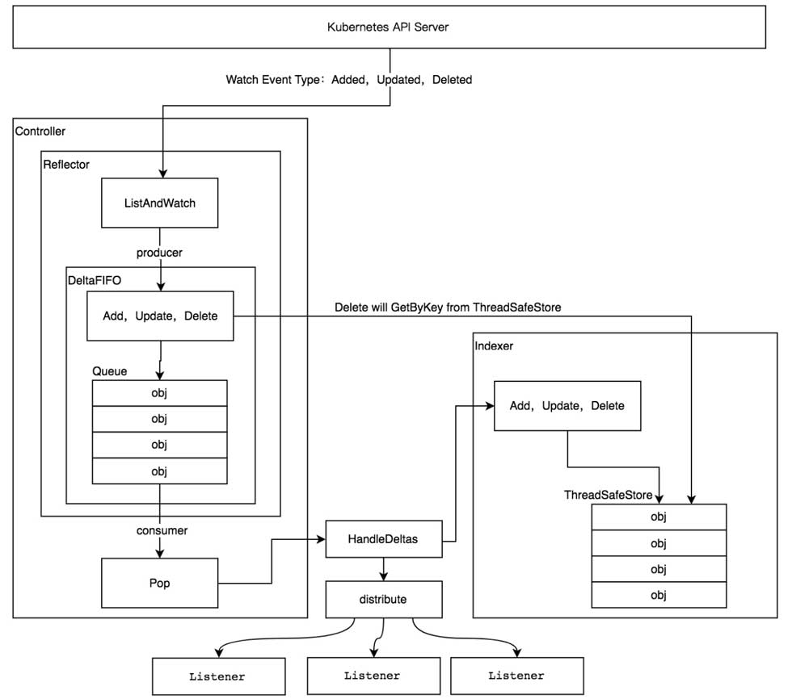

# informer简介

## Informer机制流程

- ```Reflector```：通过 Kubernetes API 监控 Kubernetes 的资源类型 采用 List/Watch 机制, 可以 Watch 任何资源包括 CRD 添加 object 对象到 DeltaFIFO 队列，然后 Informer 会从队列里面取数据进行处理。Reflector 会和 apiServer 建立长连接，并使用 ListAndWatch 方法获取并监听某一个资源的变化。List 方法将会获取某个资源的所有实例，Watch 方法则监听资源对象的创建、更新以及删除事件，然后将事件放入到DeltaFIFO Queue中；
- ```DeltaFIFO```：DeltaFIFO是一个先进先出的队列，可以保存资源对象的操作类型；
- ```Informer```：controller 机制的基础，循环处理 object 对象 从 Reflector 取出数据，然后将数据给到 Indexer 去缓存，提供对象事件的 handler 接口，只要给 Informer 添加 ResourceEventHandler 实例的回调函数，去实现 OnAdd(obj interface{})、 OnUpdate(oldObj, newObj interface{}) 和 OnDelete(obj interface{}) 这三个方法，就可以处理好资源的创建、更新和删除操作了。Informer会不断的从 Delta FIFO Queue 中 pop 增量事件，并根据事件的类型来决定新增、更新或者是删除本地缓存；接着Informer 根据事件类型来触发事先注册好的 Event Handler触发回调函数，然后然后将该事件丢到 WorkQueue 这个工作队列中。
- ```Indexer```：用来存储资源对象并自带索引功能的本地存储，提供 object 对象的索引，是线程安全的，缓存对象信息。
- ```workqueue```: 最后轮到Controller从线程安全的Workqueue中取出这个资源的key，进行事件的处理。Controller在处理事件的过程中可能是并行的，有许多个Worker线程不断从Workqueue中取事件并处理。 worker 来业务逻辑通常是计算目前集群的状态和用户希望达到的状态有多大的区别，然后不断的调和处理。Informer/SharedInformer与Worker线程的关系，实际上是一个生产者-消费者关系，利用一个Workqueue将二者分开，既实现了两个部件的解耦，也解决了双方处理速度不一致的问题。

## Informer机制分析


在k8s里，SharedInformer是Informer机制的核心，controller, reflector都包含在其中，控制着资源的监控和业务逻辑的执行。
### SharedInformer
- client-go实现了两个创建SharedInformer的接口（码源自client-go/tools/cache/shared_informer.go）
```diff
+ // lw:这个是apiserver客户端相关的，用于Reflector从apiserver获取资源，所以需要外部提供
+ // exampleObject:这个SharedInformer监控的对象类型
+ // defaultEventHandlerResyncPeriod:同步周期，SharedInformer需要多长时间给使用者发送一次全量对象的同步时间
// NewSharedInformer creates a new instance for the listwatcher.
func NewSharedInformer(lw ListerWatcher, exampleObject runtime.Object, defaultEventHandlerResyncPeriod time.Duration) SharedInformer {
	return NewSharedIndexInformer(lw, exampleObject, defaultEventHandlerResyncPeriod, Indexers{})
}

// NewSharedIndexInformer creates a new instance for the listwatcher.
// The created informer will not do resyncs if the given
// defaultEventHandlerResyncPeriod is zero.  Otherwise: for each
// handler that with a non-zero requested resync period, whether added
// before or after the informer starts, the nominal resync period is
// the requested resync period rounded up to a multiple of the
// informer's resync checking period.  Such an informer's resync
// checking period is established when the informer starts running,
// and is the maximum of (a) the minimum of the resync periods
// requested before the informer starts and the
// defaultEventHandlerResyncPeriod given here and (b) the constant
// `minimumResyncPeriod` defined in this file.
+ // indexers:需要外部提供计算对象索引键的函数，也就是这里面的对象需要通过什么方式创建索引
func NewSharedIndexInformer(lw ListerWatcher, exampleObject runtime.Object, defaultEventHandlerResyncPeriod time.Duration, indexers Indexers) SharedIndexInformer {
	realClock := &clock.RealClock{}
	sharedIndexInformer := &sharedIndexInformer{
+               // 管理所有处理器。处理器在深入理解章节再介绍
		processor:                       &sharedProcessor{clock: realClock},
+               // 其实就是在构造cache，读者可以自行查看NewIndexer()的实现，
+               // 在cache中的对象用DeletionHandlingMetaNamespaceKeyFunc计算对象键，用indexers计算索引键
+               // 可以想象成每个对象键是Namespace/Name，每个索引键是Namespace，即按照Namesapce分类
+               // 因为objType决定了只有一种类型对象，所以Namesapce是最大的分类
		indexer:                         NewIndexer(DeletionHandlingMetaNamespaceKeyFunc, indexers),
+               // 下面这两主要就是给Controller用，确切的说是给Reflector用的，其中objectType定义了需要reflect的对象类型
		listerWatcher:                   lw,
		objectType:                      exampleObject,
+               // 无论是否需要定时同步，SharedInformer都提供了一个默认的同步时间，当然这个是外部设置的    
		resyncCheckPeriod:               defaultEventHandlerResyncPeriod,
		defaultEventHandlerResyncPeriod: defaultEventHandlerResyncPeriod,
		cacheMutationDetector:           NewCacheMutationDetector(fmt.Sprintf("%T", exampleObject)),
		clock:                           realClock,
	}
	return sharedIndexInformer
}

// `*sharedIndexInformer` implements SharedIndexInformer and has three
// main components.  One is an indexed local cache, `indexer Indexer`.
// The second main component is a Controller that pulls
// objects/notifications using the ListerWatcher and pushes them into
// a DeltaFIFO --- whose knownObjects is the informer's local cache
// --- while concurrently Popping Deltas values from that fifo and
// processing them with `sharedIndexInformer::HandleDeltas`.  Each
// invocation of HandleDeltas, which is done with the fifo's lock
// held, processes each Delta in turn.  For each Delta this both
// updates the local cache and stuffs the relevant notification into
// the sharedProcessor.  The third main component is that
// sharedProcessor, which is responsible for relaying those
// notifications to each of the informer's clients.
type sharedIndexInformer struct {
	indexer    Indexer
	controller Controller

	processor             *sharedProcessor
	cacheMutationDetector MutationDetector

	listerWatcher ListerWatcher

	// objectType is an example object of the type this informer is
	// expected to handle.  Only the type needs to be right, except
	// that when that is `unstructured.Unstructured` the object's
	// `"apiVersion"` and `"kind"` must also be right.
	objectType runtime.Object

	// resyncCheckPeriod is how often we want the reflector's resync timer to fire so it can call
	// shouldResync to check if any of our listeners need a resync.
	resyncCheckPeriod time.Duration
	// defaultEventHandlerResyncPeriod is the default resync period for any handlers added via
	// AddEventHandler (i.e. they don't specify one and just want to use the shared informer's default
	// value).
	defaultEventHandlerResyncPeriod time.Duration
	// clock allows for testability
	clock clock.Clock

	started, stopped bool
	startedLock      sync.Mutex

	// blockDeltas gives a way to stop all event distribution so that a late event handler
	// can safely join the shared informer.
	blockDeltas sync.Mutex

	// Called whenever the ListAndWatch drops the connection with an error.
	watchErrorHandler WatchErrorHandler
}
```

- 添加事件处理handler
```diff
func (s *sharedIndexInformer) AddEventHandler(handler ResourceEventHandler) {
	s.AddEventHandlerWithResyncPeriod(handler, s.defaultEventHandlerResyncPeriod)
}

func (s *sharedIndexInformer) AddEventHandlerWithResyncPeriod(handler ResourceEventHandler, resyncPeriod time.Duration) {
	s.startedLock.Lock()
	defer s.startedLock.Unlock()
+	// 如果已经结束，则直接返回
	if s.stopped {
		klog.V(2).Infof("Handler %v was not added to shared informer because it has stopped already", handler)
		return
	}
+	// 如果有同步周期，==0就是永远不用同步
	if resyncPeriod > 0 {
+		// 同步周期不能太短，太短对于系统来说反而是个负担，大量的无效计算浪费在这上面	
		if resyncPeriod < minimumResyncPeriod {
			klog.Warningf("resyncPeriod %v is too small. Changing it to the minimum allowed value of %v", resyncPeriod, minimumResyncPeriod)
			resyncPeriod = minimumResyncPeriod
		}
+        	// SharedInformer管理了很多处理器，每个处理器都有自己的同步周期，所以此处要统一成一个，称之为对齐
+        	// SharedInformer会选择所有处理器中最小的那个作为所有处理器的同步周期，称为对齐后的同步周期
+        	// 此处就要判断是不是比当前对齐后的同步周期还要小
		if resyncPeriod < s.resyncCheckPeriod {
+			// 如果已经启动了，那么只能用和大家一样的周期		
			if s.started {
				klog.Warningf("resyncPeriod %v is smaller than resyncCheckPeriod %v and the informer has already started. Changing it to %v", resyncPeriod, s.resyncCheckPeriod, s.resyncCheckPeriod)
				resyncPeriod = s.resyncCheckPeriod
			} else {
+				// 如果没启动，那就让大家都用最新的对齐同步周期			
				// if the event handler's resyncPeriod is smaller than the current resyncCheckPeriod, update
				// resyncCheckPeriod to match resyncPeriod and adjust the resync periods of all the listeners
				// accordingly
				s.resyncCheckPeriod = resyncPeriod
				s.processor.resyncCheckPeriodChanged(resyncPeriod)
			}
		}
	}

+	// 创建processor的listener
-	listener := newProcessListener(handler, resyncPeriod, determineResyncPeriod(resyncPeriod, s.resyncCheckPeriod), s.clock.Now(), initialBufferSize)

	if !s.started {
		s.processor.addListener(listener)
		return
	}
+	// 这个锁就是暂停再想所有的处理器分发事件用的，因为这样会遍历所有的处理器，此时添加会有风险
	// in order to safely join, we have to
	// 1. stop sending add/update/delete notifications
	// 2. do a list against the store
	// 3. send synthetic "Add" events to the new handler
	// 4. unblock
	s.blockDeltas.Lock()
	defer s.blockDeltas.Unlock()

	s.processor.addListener(listener)
+	// 遍历缓冲中的所有对象，通知处理器，因为SharedInformer已经启动了，可能很多对象已经让其他的处理器处理过了，
+	// 所以这些对象就不会再通知新添加的处理器，此处就是解决这个问题的
	for _, item := range s.indexer.List() {
		listener.add(addNotification{newObj: item})
	}
}

func newProcessListener(handler ResourceEventHandler, requestedResyncPeriod, resyncPeriod time.Duration, now time.Time, bufferSize int) *processorListener {
	ret := &processorListener{
		nextCh:                make(chan interface{}),
		addCh:                 make(chan interface{}),
		handler:               handler,
		pendingNotifications:  *buffer.NewRingGrowing(bufferSize),
		requestedResyncPeriod: requestedResyncPeriod,
		resyncPeriod:          resyncPeriod,
	}

	ret.determineNextResync(now)

	return ret
}
```

- SharedInformer分发事件给每个处理器
```diff
func (s *sharedIndexInformer) Run(stopCh <-chan struct{}) {
	defer utilruntime.HandleCrash()

	if s.HasStarted() {
		klog.Warningf("The sharedIndexInformer has started, run more than once is not allowed")
		return
	}
	fifo := NewDeltaFIFOWithOptions(DeltaFIFOOptions{
		KnownObjects:          s.indexer,
		EmitDeltaTypeReplaced: true,
	})

	cfg := &Config{
		Queue:            fifo,
		ListerWatcher:    s.listerWatcher,
		ObjectType:       s.objectType,
		FullResyncPeriod: s.resyncCheckPeriod,
		RetryOnError:     false,
		ShouldResync:     s.processor.shouldResync,

		Process:           s.HandleDeltas,
		WatchErrorHandler: s.watchErrorHandler,
	}

	func() {
		s.startedLock.Lock()
		defer s.startedLock.Unlock()

		s.controller = New(cfg)
		s.controller.(*controller).clock = s.clock
		s.started = true
	}()

	// Separate stop channel because Processor should be stopped strictly after controller
	processorStopCh := make(chan struct{})
	var wg wait.Group
	defer wg.Wait()              // Wait for Processor to stop
	defer close(processorStopCh) // Tell Processor to stop
	wg.StartWithChannel(processorStopCh, s.cacheMutationDetector.Run)
	wg.StartWithChannel(processorStopCh, s.processor.run)

	defer func() {
		s.startedLock.Lock()
		defer s.startedLock.Unlock()
		s.stopped = true // Don't want any new listeners
	}()
	s.controller.Run(stopCh)
}

// New makes a new Controller from the given Config.
func New(c *Config) Controller {
	ctlr := &controller{
		config: *c,
		clock:  &clock.RealClock{},
	}
	return ctlr
}
```

这里面引入Config和Controller
```diff
// This file implements a low-level controller that is used in
// sharedIndexInformer, which is an implementation of
// SharedIndexInformer.  Such informers, in turn, are key components
// in the high level controllers that form the backbone of the
// Kubernetes control plane.  Look at those for examples, or the
// example in
// https://github.com/kubernetes/client-go/tree/master/examples/workqueue
// .

// Config contains all the settings for one of these low-level controllers.
type Config struct {
	// The queue for your objects - has to be a DeltaFIFO due to
	// assumptions in the implementation. Your Process() function
	// should accept the output of this Queue's Pop() method.
	Queue

	// Something that can list and watch your objects.
	ListerWatcher

	// Something that can process a popped Deltas.
	Process ProcessFunc

	// ObjectType is an example object of the type this controller is
	// expected to handle.  Only the type needs to be right, except
	// that when that is `unstructured.Unstructured` the object's
	// `"apiVersion"` and `"kind"` must also be right.
	ObjectType runtime.Object

	// FullResyncPeriod is the period at which ShouldResync is considered.
	FullResyncPeriod time.Duration

	// ShouldResync is periodically used by the reflector to determine
	// whether to Resync the Queue. If ShouldResync is `nil` or
	// returns true, it means the reflector should proceed with the
	// resync.
	ShouldResync ShouldResyncFunc

	// If true, when Process() returns an error, re-enqueue the object.
	// TODO: add interface to let you inject a delay/backoff or drop
	//       the object completely if desired. Pass the object in
	//       question to this interface as a parameter.  This is probably moot
	//       now that this functionality appears at a higher level.
	RetryOnError bool

	// Called whenever the ListAndWatch drops the connection with an error.
	WatchErrorHandler WatchErrorHandler

	// WatchListPageSize is the requested chunk size of initial and relist watch lists.
	WatchListPageSize int64
}
```

controller定义
```diff
// `*controller` implements Controller
type controller struct {
	config         Config
	reflector      *Reflector
	reflectorMutex sync.RWMutex
	clock          clock.Clock
}

// Controller is a low-level controller that is parameterized by a
// Config and used in sharedIndexInformer.
type Controller interface {
	// Run does two things.  One is to construct and run a Reflector
	// to pump objects/notifications from the Config's ListerWatcher
	// to the Config's Queue and possibly invoke the occasional Resync
	// on that Queue.  The other is to repeatedly Pop from the Queue
	// and process with the Config's ProcessFunc.  Both of these
	// continue until `stopCh` is closed.
	Run(stopCh <-chan struct{})

	// HasSynced delegates to the Config's Queue
	HasSynced() bool

	// LastSyncResourceVersion delegates to the Reflector when there
	// is one, otherwise returns the empty string
	LastSyncResourceVersion() string
}
```

- controller.Run
```diff
// Run begins processing items, and will continue until a value is sent down stopCh or it is closed.
// It's an error to call Run more than once.
// Run blocks; call via go.
func (c *controller) Run(stopCh <-chan struct{}) {
	defer utilruntime.HandleCrash()
	go func() {
		<-stopCh
		c.config.Queue.Close()
	}()
	r := NewReflector(
		c.config.ListerWatcher,
		c.config.ObjectType,
		c.config.Queue,
		c.config.FullResyncPeriod,
	)
	r.ShouldResync = c.config.ShouldResync
	r.WatchListPageSize = c.config.WatchListPageSize
	r.clock = c.clock
	if c.config.WatchErrorHandler != nil {
		r.watchErrorHandler = c.config.WatchErrorHandler
	}

	c.reflectorMutex.Lock()
	c.reflector = r
	c.reflectorMutex.Unlock()

	var wg wait.Group

	wg.StartWithChannel(stopCh, r.Run)

	wait.Until(c.processLoop, time.Second, stopCh)
	wg.Wait()
}

// Returns true once this controller has completed an initial resource listing
func (c *controller) HasSynced() bool {
	return c.config.Queue.HasSynced()
}

func (c *controller) LastSyncResourceVersion() string {
	c.reflectorMutex.RLock()
	defer c.reflectorMutex.RUnlock()
	if c.reflector == nil {
		return ""
	}
	return c.reflector.LastSyncResourceVersion()
}
```
