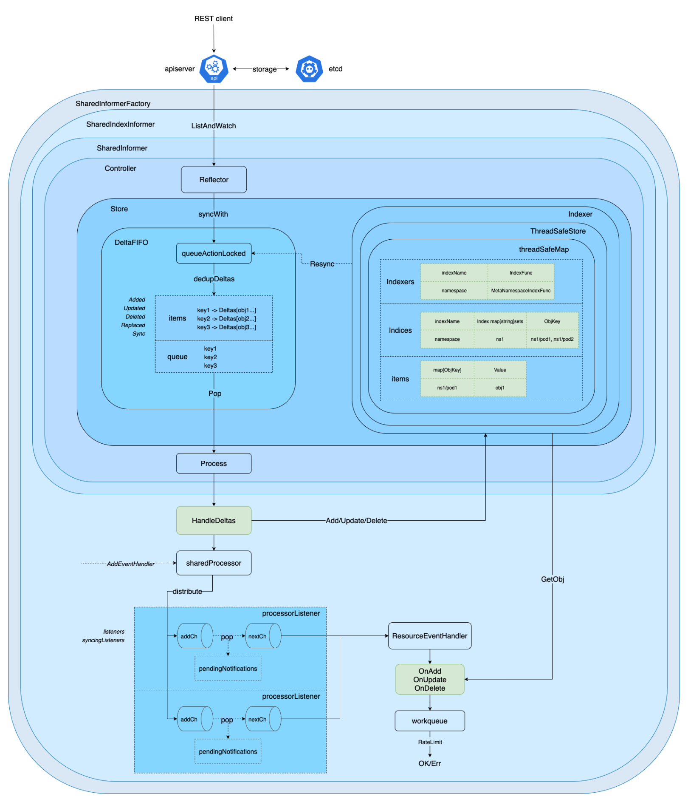

# K8S Informer进阶
>> K8s中有几十种类型的资源，如何能让 K8s 内部以及外部用户方便、高效的获取某类资源的变化，就是Informer的工作。
>> 在k8s_informer机制一文，介绍了informer的大致工作流程，本文是该部分进阶学习，重点在Reflector，DeltaFifo和Indexer。




## Reflector

Reflector 的主要职责是从apiserver拉取并持续监听(ListAndWatch)相关资源类型的增删改(Add/Update/Delete)事件, 存储在由DeltaFIFO实现的本地缓存(local Store)中。
首先看一下Reflector结构体定义:
```diff
// staging/src/k8s.io/client-go/tools/cache/reflector.go
type Reflector struct {
    // 通过 file:line 唯一标识的 name
    name string

    // 下面三个为了确认类型
    expectedTypeName string
    expectedType     reflect.Type
    expectedGVK      *schema.GroupVersionKind

    // 存储 interface: 具体由 DeltaFIFO 实现存储
    store Store
    // 用来从 apiserver 拉取全量和增量资源
    listerWatcher ListerWatcher

    // 下面两个用来做失败重试
    backoffManager         wait.BackoffManager
    initConnBackoffManager wait.BackoffManager

    // informer 使用者重新同步的周期
    resyncPeriod time.Duration
    // 判断是否满足可以重新同步的条件
    ShouldResync func() bool

    clock clock.Clock

    // 是否要进行分页 List
    paginatedResult bool

    // 最后同步的资源版本号，以此为依据，watch 只会监听大于此值的资源
    lastSyncResourceVersion string
    // 最后同步的资源版本号是否可用
    isLastSyncResourceVersionUnavailable bool
    // 加把锁控制版本号
    lastSyncResourceVersionMutex sync.RWMutex

    // 每页大小
    WatchListPageSize int64
    // watch 失败回调 handler
    watchErrorHandler WatchErrorHandler
}
```
第一次拉取全量资源(目标资源类型) 后通过syncWith函数全量替换(Replace)到DeltaFIFO queue/items 中，之后通过持续监听 Watch(目标资源类型) 增量事件，并去重更新到DeltaFIFO queue/items中，等待被消费。

- Reflector.Run
```diff
// Run repeatedly uses the reflector's ListAndWatch to fetch all the
// objects and subsequent deltas.
// Run will exit when stopCh is closed.
func (r *Reflector) Run(stopCh <-chan struct{}) {
	klog.V(3).Infof("Starting reflector %s (%s) from %s", r.expectedTypeName, r.resyncPeriod, r.name)
	wait.BackoffUntil(func() {
		if err := r.ListAndWatch(stopCh); err != nil {
			r.watchErrorHandler(r, err)
		}
	}, r.backoffManager, true, stopCh)
	klog.V(3).Infof("Stopping reflector %s (%s) from %s", r.expectedTypeName, r.resyncPeriod, r.name)
}
```

- ListAndRun是Reflector的核心逻辑
```diff
// ListAndWatch first lists all items and get the resource version at the moment of call,
// and then use the resource version to watch.
// It returns error if ListAndWatch didn't even try to initialize watch.
func (r *Reflector) ListAndWatch(stopCh <-chan struct{}) error {
	klog.V(3).Infof("Listing and watching %v from %s", r.expectedTypeName, r.name)
	var resourceVersion string

	options := metav1.ListOptions{ResourceVersion: r.relistResourceVersion()}

	if err := func() error {
		initTrace := trace.New("Reflector ListAndWatch", trace.Field{Key: "name", Value: r.name})
		defer initTrace.LogIfLong(10 * time.Second)
		var list runtime.Object
		var paginatedResult bool
		var err error
		listCh := make(chan struct{}, 1)
		panicCh := make(chan interface{}, 1)
		go func() {
			defer func() {
				if r := recover(); r != nil {
					panicCh <- r
				}
			}()
			// Attempt to gather list in chunks, if supported by listerWatcher, if not, the first
			// list request will return the full response.
			pager := pager.New(pager.SimplePageFunc(func(opts metav1.ListOptions) (runtime.Object, error) {
				return r.listerWatcher.List(opts)
			}))
			switch {
			case r.WatchListPageSize != 0:
				pager.PageSize = r.WatchListPageSize
			case r.paginatedResult:
				// We got a paginated result initially. Assume this resource and server honor
				// paging requests (i.e. watch cache is probably disabled) and leave the default
				// pager size set.
			case options.ResourceVersion != "" && options.ResourceVersion != "0":
				// User didn't explicitly request pagination.
				//
				// With ResourceVersion != "", we have a possibility to list from watch cache,
				// but we do that (for ResourceVersion != "0") only if Limit is unset.
				// To avoid thundering herd on etcd (e.g. on master upgrades), we explicitly
				// switch off pagination to force listing from watch cache (if enabled).
				// With the existing semantic of RV (result is at least as fresh as provided RV),
				// this is correct and doesn't lead to going back in time.
				//
				// We also don't turn off pagination for ResourceVersion="0", since watch cache
				// is ignoring Limit in that case anyway, and if watch cache is not enabled
				// we don't introduce regression.
				pager.PageSize = 0
			}

+           // 全量List一次
			list, paginatedResult, err = pager.List(context.Background(), options)
			close(listCh)
		}()
		select {
		case <-stopCh:
			return nil
		case r := <-panicCh:
			panic(r)
		case <-listCh:
		}
		initTrace.Step("Objects listed", trace.Field{Key: "error", Value: err})

		// We check if the list was paginated and if so set the paginatedResult based on that.
		// However, we want to do that only for the initial list (which is the only case
		// when we set ResourceVersion="0"). The reasoning behind it is that later, in some
		// situations we may force listing directly from etcd (by setting ResourceVersion="")
		// which will return paginated result, even if watch cache is enabled. However, in
		// that case, we still want to prefer sending requests to watch cache if possible.
		//
		// Paginated result returned for request with ResourceVersion="0" mean that watch
		// cache is disabled and there are a lot of objects of a given type. In such case,
		// there is no need to prefer listing from watch cache.
		if options.ResourceVersion == "0" && paginatedResult {
			r.paginatedResult = true
		}

		r.setIsLastSyncResourceVersionUnavailable(false) // list was successful
		listMetaInterface, err := meta.ListAccessor(list)

		resourceVersion = listMetaInterface.GetResourceVersion()
		initTrace.Step("Resource version extracted")
+       // list转换成items        
		items, err := meta.ExtractList(list)

		initTrace.Step("Objects extracted")
+       // syncWith        
		if err := r.syncWith(items, resourceVersion); err != nil {
			return fmt.Errorf("unable to sync list result: %v", err)
		}
		initTrace.Step("SyncWith done")
		r.setLastSyncResourceVersion(resourceVersion)
		initTrace.Step("Resource version updated")
		return nil
	}(); err != nil {
		return err
	}

	resyncerrc := make(chan error, 1)
	cancelCh := make(chan struct{})
	defer close(cancelCh)
	go func() {
		resyncCh, cleanup := r.resyncChan()
		defer func() {
			cleanup() // Call the last one written into cleanup
		}()
		for {
			select {
			case <-resyncCh:
			case <-stopCh:
				return
			case <-cancelCh:
				return
			}
			if r.ShouldResync == nil || r.ShouldResync() {
				klog.V(4).Infof("%s: forcing resync", r.name)
				if err := r.store.Resync(); err != nil {
					resyncerrc <- err
					return
				}
			}
			cleanup()
			resyncCh, cleanup = r.resyncChan()
		}
	}()

	for {
		// give the stopCh a chance to stop the loop, even in case of continue statements further down on errors
		select {
		case <-stopCh:
			return nil
		default:
		}

		timeoutSeconds := int64(minWatchTimeout.Seconds() * (rand.Float64() + 1.0))
		options = metav1.ListOptions{
			ResourceVersion: resourceVersion,
			// We want to avoid situations of hanging watchers. Stop any watchers that do not
			// receive any events within the timeout window.
			TimeoutSeconds: &timeoutSeconds,
			// To reduce load on kube-apiserver on watch restarts, you may enable watch bookmarks.
			// Reflector doesn't assume bookmarks are returned at all (if the server do not support
			// watch bookmarks, it will ignore this field).
			AllowWatchBookmarks: true,
		}

		// start the clock before sending the request, since some proxies won't flush headers until after the first watch event is sent
		start := r.clock.Now()
+       // watch资源        
		w, err := r.listerWatcher.Watch(options)

		if err := r.watchHandler(start, w, &resourceVersion, resyncerrc, stopCh); err != nil {
			if err != errorStopRequested {
				switch {
				case isExpiredError(err):
					// Don't set LastSyncResourceVersionUnavailable - LIST call with ResourceVersion=RV already
					// has a semantic that it returns data at least as fresh as provided RV.
					// So first try to LIST with setting RV to resource version of last observed object.
					klog.V(4).Infof("%s: watch of %v closed with: %v", r.name, r.expectedTypeName, err)
				case apierrors.IsTooManyRequests(err):
					klog.V(2).Infof("%s: watch of %v returned 429 - backing off", r.name, r.expectedTypeName)
					<-r.initConnBackoffManager.Backoff().C()
					continue
				default:
					klog.Warningf("%s: watch of %v ended with: %v", r.name, r.expectedTypeName, err)
				}
			}
			return nil
		}
	}
}

// SimplePageFunc adapts a context-less list function into one that accepts a context.
func SimplePageFunc(fn func(opts metav1.ListOptions) (runtime.Object, error)) ListPageFunc {
	return func(ctx context.Context, opts metav1.ListOptions) (runtime.Object, error) {
		return fn(opts)
	}
}

// ListPager assists client code in breaking large list queries into multiple
// smaller chunks of PageSize or smaller. PageFn is expected to accept a
// metav1.ListOptions that supports paging and return a list. The pager does
// not alter the field or label selectors on the initial options list.
type ListPager struct {
	PageSize int64
	PageFn   ListPageFunc

	FullListIfExpired bool

	// Number of pages to buffer
	PageBufferSize int32
}

// New creates a new pager from the provided pager function using the default
// options. It will fall back to a full list if an expiration error is encountered
// as a last resort.
func New(fn ListPageFunc) *ListPager {
	return &ListPager{
		PageSize:          defaultPageSize,
		PageFn:            fn,
		FullListIfExpired: true,
		PageBufferSize:    defaultPageBufferSize,
	}
}

// List returns a single list object, but attempts to retrieve smaller chunks from the
// server to reduce the impact on the server. If the chunk attempt fails, it will load
// the full list instead. The Limit field on options, if unset, will default to the page size.
func (p *ListPager) List(ctx context.Context, options metav1.ListOptions) (runtime.Object, bool, error) {
	if options.Limit == 0 {
		options.Limit = p.PageSize
	}
	requestedResourceVersion := options.ResourceVersion
	requestedResourceVersionMatch := options.ResourceVersionMatch
	var list *metainternalversion.List
	paginatedResult := false

	for {
		select {
		case <-ctx.Done():
			return nil, paginatedResult, ctx.Err()
		default:
		}

		obj, err := p.PageFn(ctx, options)
		if err != nil {
			// Only fallback to full list if an "Expired" errors is returned, FullListIfExpired is true, and
			// the "Expired" error occurred in page 2 or later (since full list is intended to prevent a pager.List from
			// failing when the resource versions is established by the first page request falls out of the compaction
			// during the subsequent list requests).
			if !errors.IsResourceExpired(err) || !p.FullListIfExpired || options.Continue == "" {
				return nil, paginatedResult, err
			}
			// the list expired while we were processing, fall back to a full list at
			// the requested ResourceVersion.
			options.Limit = 0
			options.Continue = ""
			options.ResourceVersion = requestedResourceVersion
			options.ResourceVersionMatch = requestedResourceVersionMatch
			result, err := p.PageFn(ctx, options)
			return result, paginatedResult, err
		}
		m, err := meta.ListAccessor(obj)
		if err != nil {
			return nil, paginatedResult, fmt.Errorf("returned object must be a list: %v", err)
		}

		// exit early and return the object we got if we haven't processed any pages
		if len(m.GetContinue()) == 0 && list == nil {
			return obj, paginatedResult, nil
		}

		// initialize the list and fill its contents
		if list == nil {
			list = &metainternalversion.List{Items: make([]runtime.Object, 0, options.Limit+1)}
			list.ResourceVersion = m.GetResourceVersion()
			list.SelfLink = m.GetSelfLink()
		}
		if err := meta.EachListItem(obj, func(obj runtime.Object) error {
			list.Items = append(list.Items, obj)
			return nil
		}); err != nil {
			return nil, paginatedResult, err
		}

		// if we have no more items, return the list
		if len(m.GetContinue()) == 0 {
			return list, paginatedResult, nil
		}

		// set the next loop up
		options.Continue = m.GetContinue()
		// Clear the ResourceVersion(Match) on the subsequent List calls to avoid the
		// `specifying resource version is not allowed when using continue` error.
		// See https://github.com/kubernetes/kubernetes/issues/85221#issuecomment-553748143.
		options.ResourceVersion = ""
		options.ResourceVersionMatch = ""
		// At this point, result is already paginated.
		paginatedResult = true
	}
}
```

- watchHandler
```diff
// watchHandler watches w and keeps *resourceVersion up to date.
func (r *Reflector) watchHandler(start time.Time, w watch.Interface, resourceVersion *string, errc chan error, stopCh <-chan struct{}) error {
	eventCount := 0

	// Stopping the watcher should be idempotent and if we return from this function there's no way
	// we're coming back in with the same watch interface.
	defer w.Stop()

loop:
	for {
		select {
		case <-stopCh:
			return errorStopRequested
		case err := <-errc:
			return err
		case event, ok := <-w.ResultChan():
			if !ok {
				break loop
			}
			if event.Type == watch.Error {
				return apierrors.FromObject(event.Object)
			}
			if r.expectedType != nil {
				if e, a := r.expectedType, reflect.TypeOf(event.Object); e != a {
					utilruntime.HandleError(fmt.Errorf("%s: expected type %v, but watch event object had type %v", r.name, e, a))
					continue
				}
			}
			if r.expectedGVK != nil {
				if e, a := *r.expectedGVK, event.Object.GetObjectKind().GroupVersionKind(); e != a {
					utilruntime.HandleError(fmt.Errorf("%s: expected gvk %v, but watch event object had gvk %v", r.name, e, a))
					continue
				}
			}
			meta, err := meta.Accessor(event.Object)
			if err != nil {
				utilruntime.HandleError(fmt.Errorf("%s: unable to understand watch event %#v", r.name, event))
				continue
			}
			newResourceVersion := meta.GetResourceVersion()
			switch event.Type {
			case watch.Added:
				err := r.store.Add(event.Object)
				if err != nil {
					utilruntime.HandleError(fmt.Errorf("%s: unable to add watch event object (%#v) to store: %v", r.name, event.Object, err))
				}
			case watch.Modified:
				err := r.store.Update(event.Object)
				if err != nil {
					utilruntime.HandleError(fmt.Errorf("%s: unable to update watch event object (%#v) to store: %v", r.name, event.Object, err))
				}
			case watch.Deleted:
				// TODO: Will any consumers need access to the "last known
				// state", which is passed in event.Object? If so, may need
				// to change this.
				err := r.store.Delete(event.Object)
				if err != nil {
					utilruntime.HandleError(fmt.Errorf("%s: unable to delete watch event object (%#v) from store: %v", r.name, event.Object, err))
				}
			case watch.Bookmark:
				// A `Bookmark` means watch has synced here, just update the resourceVersion
			default:
				utilruntime.HandleError(fmt.Errorf("%s: unable to understand watch event %#v", r.name, event))
			}
			*resourceVersion = newResourceVersion
			r.setLastSyncResourceVersion(newResourceVersion)
			if rvu, ok := r.store.(ResourceVersionUpdater); ok {
				rvu.UpdateResourceVersion(newResourceVersion)
			}
			eventCount++
		}
	}

	watchDuration := r.clock.Since(start)
	if watchDuration < 1*time.Second && eventCount == 0 {
		return fmt.Errorf("very short watch: %s: Unexpected watch close - watch lasted less than a second and no items received", r.name)
	}
	klog.V(4).Infof("%s: Watch close - %v total %v items received", r.name, r.expectedTypeName, eventCount)
	return nil
}
```
## DeltaFifo

DeltaFIFO 的职责是通过队列加锁处理(queueActionLocked)、去重(dedupDeltas)、存储在由 DeltaFIFO 实现的本地缓存(local Store) 中，包括 queue(仅存 objKeys) 和 items(存 objKeys 和对应的 Deltas 增量变化)，并通过 Pop 不断消费，通过 Process(item) 处理相关逻辑。


```difff
// staging/src/k8s.io/client-go/tools/cache/delta_fifo.go
type DeltaFIFO struct {
    // 读写锁、条件变量
    lock sync.RWMutex
    cond sync.Cond

    // kv 存储：objKey1->Deltas[obj1-Added, obj1-Updated...]
    items map[string]Deltas

    // 只存储所有 objKeys
    queue []string

    // 是否已经填充：通过 Replace() 接口将第一批对象放入队列，或者第一次调用增、删、改接口时标记为true
    populated bool
    // 通过 Replace() 接口将第一批对象放入队列的数量
    initialPopulationCount int

    // keyFunc 用来从某个 obj 中获取其对应的 objKey
    keyFunc KeyFunc

    // 已知对象，其实就是 Indexer
    knownObjects KeyListerGetter

    // 队列是否已经关闭
    closed bool

    // 以 Replaced 类型发送(为了兼容老版本的 Sync)
    emitDeltaTypeReplaced bool
}

+ // Delta的类型有5种
type DeltaType string

const (
    Added   DeltaType = "Added"
    Updated DeltaType = "Updated"
    Deleted DeltaType = "Deleted"
    Replaced DeltaType = "Replaced" // 第一次或重新同步
    Sync DeltaType = "Sync" // 老版本重新同步叫 Sync
)
```
