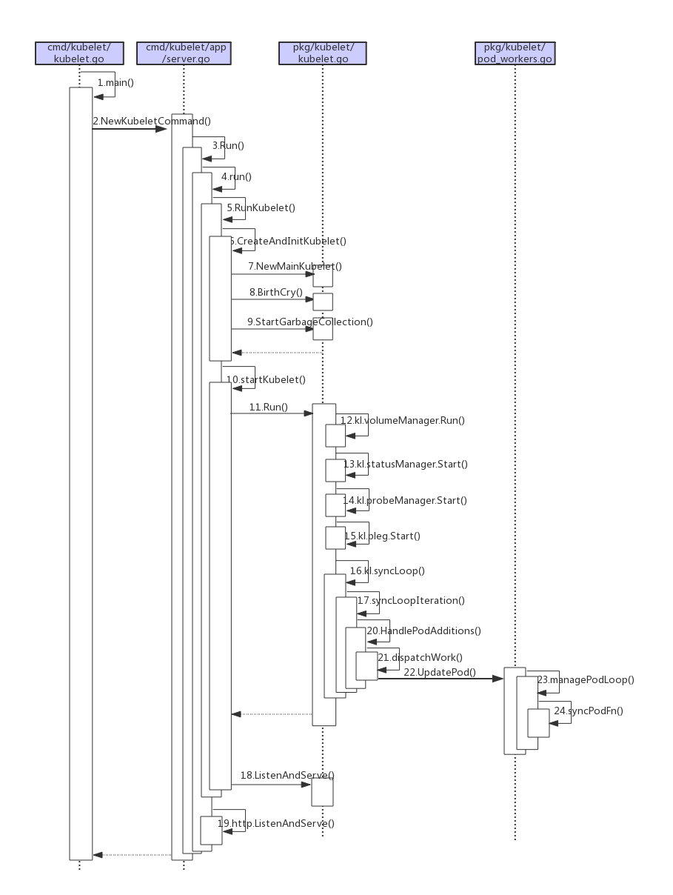

# Kubelet代码分析
> 在Kubernetes集群中，每个Node节点（又称Minion）上都会启动一个Kubelet服务进行。
> 该进程用于处理Master节点下发到本节点的任务，管理Pod及Pod中的容器。
> 每个Kubelet进程会在API Server上注册节点自身信息，定期向Master节点汇报节点资源的使用情况，并通过cAdvise监控容器和节点资源。

- kubelet 主要功能：

1. pod 管理：kubelet 定期从所监听的数据源获取节点上 pod/container 的期望状态（运行什么容器、运行的副本数量、网络或者存储如何配置等等），并调用对应的容器平台接口达到这个状态。

2. 容器健康检查：kubelet 创建了容器之后还要查看容器是否正常运行，如果容器运行出错，就要根据 pod 设置的重启策略进行处理。

3. 容器监控：kubelet 会监控所在节点的资源使用情况，并定时向 master 报告，资源使用数据都是通过 cAdvisor 获取的。知道整个集群所有节点的资源情况，对于 pod 的调度和正常运行至关重要。


kubelet 默认监听四个端口，分别为 10250 、10255、10248、4194。
```
LISTEN     0      128          *:10250                    *:*                   users:(("kubelet",pid=48500,fd=28))
LISTEN     0      128          *:10255                    *:*                   users:(("kubelet",pid=48500,fd=26))
LISTEN     0      128          *:4194                     *:*                   users:(("kubelet",pid=48500,fd=13))
LISTEN     0      128    127.0.0.1:10248                    *:*                   users:(("kubelet",pid=48500,fd=23))
```

  - 10250（kubelet API）：kubelet server 与 apiserver 通信的端口，定期请求 apiserver 获取自己所应当处理的任务，通过该端口可以访问获取 node 资源以及状态。

  - 10248（健康检查端口）：通过访问该端口可以判断 kubelet 是否正常工作, 通过 kubelet 的启动参数 --healthz-port 和 --healthz-bind-address 来指定监听的地址和端口。
 ```
 $ curl http://127.0.0.1:10248/healthz
ok
 ```
  - 4194（cAdvisor 监听）：kublet 通过该端口可以获取到该节点的环境信息以及 node 上运行的容器状态等内容，访问 http://localhost:4194 可以看到 cAdvisor 的管理界面,通过 kubelet 的启动参数 --cadvisor-port 可以指定启动的端口。
```
 $ curl  http://127.0.0.1:4194/metrics
```
  - 10255 （readonly API）：提供了 pod 和 node 的信息，接口以只读形式暴露出去，访问该端口不需要认证和鉴权。
```
//  获取 pod 的接口，与 apiserver 的 
// http://127.0.0.1:8080/api/v1/pods?fieldSelector=spec.nodeName=  接口类似
$ curl  http://127.0.0.1:10255/pods
// 节点信息接口,提供磁盘、网络、CPU、内存等信息
$ curl http://127.0.0.1:10255/spec/
```
模块图


1. PLEG(Pod Lifecycle Event Generator） PLEG 是 kubelet 的核心模块,PLEG 会一直调用 container runtime 获取本节点 containers/sandboxes 的信息，并与自身维护的 pods cache 信息进行对比，生成对应的 PodLifecycleEvent，然后输出到 eventChannel 中，通过 eventChannel 发送到 kubelet syncLoop 进行消费，然后由 kubelet syncPod 来触发 pod 同步处理过程，最终达到用户的期望状态。

2. cAdvisor cAdvisor（https://github.com/google/cadvisor）是 google 开发的容器监控工具，集成在 kubelet 中，起到收集本节点和容器的监控信息，大部分公司对容器的监控数据都是从 cAdvisor 中获取的 ，cAvisor 模块对外提供了 interface 接口，该接口也被 imageManager，OOMWatcher，containerManager 等所使用。

3. OOMWatcher 系统 OOM 的监听器，会与 cadvisor 模块之间建立 SystemOOM,通过 Watch方式从 cadvisor 那里收到的 OOM 信号，并产生相关事件。

4. probeManager probeManager 依赖于 statusManager,livenessManager,containerRefManager，会定时去监控 pod 中容器的健康状况，当前支持两种类型的探针：livenessProbe 和readinessProbe。 livenessProbe：用于判断容器是否存活，如果探测失败，kubelet 会 kill 掉该容器，并根据容器的重启策略做相应的处理。 readinessProbe：用于判断容器是否启动完成，将探测成功的容器加入到该 pod 所在 service 的 endpoints 中，反之则移除。readinessProbe 和 livenessProbe 有三种实现方式：http、tcp 以及 cmd。

5. statusManager statusManager 负责维护状态信息，并把 pod 状态更新到 apiserver，但是它并不负责监控 pod 状态的变化，而是提供对应的接口供其他组件调用，比如 probeManager。

6. containerRefManager 容器引用的管理，相对简单的Manager，用来报告容器的创建，失败等事件，通过定义 map 来实现了 containerID 与 v1.ObjectReferece 容器引用的映射。

7. evictionManager 当节点的内存、磁盘或 inode 等资源不足时，达到了配置的 evict 策略， node 会变为 pressure 状态，此时 kubelet 会按照 qosClass 顺序来驱赶 pod，以此来保证节点的稳定性。可以通过配置 kubelet 启动参数 --eviction-hard= 来决定 evict 的策略值。

8. imageGC imageGC 负责 node 节点的镜像回收，当本地的存放镜像的本地磁盘空间达到某阈值的时候，会触发镜像的回收，删除掉不被 pod 所使用的镜像，回收镜像的阈值可以通过 kubelet 的启动参数 --image-gc-high-threshold 和 --image-gc-low-threshold 来设置。

9. containerGC containerGC 负责清理 node 节点上已消亡的 container，具体的 GC 操作由runtime 来实现。

10. imageManager 调用 kubecontainer 提供的PullImage/GetImageRef/ListImages/RemoveImage/ImageStates 方法来保证pod 运行所需要的镜像。

11. volumeManager 负责 node 节点上 pod 所使用 volume 的管理，volume 与 pod 的生命周期关联，负责 pod 创建删除过程中 volume 的 mount/umount/attach/detach 流程，kubernetes 采用 volume Plugins 的方式，实现存储卷的挂载等操作，内置几十种存储插件。

12. containerManager 负责 node 节点上运行的容器的 cgroup 配置信息，kubelet 启动参数如果指定 --cgroups-per-qos 的时候，kubelet 会启动 goroutine 来周期性的更新 pod 的 cgroup 信息，维护其正确性，该参数默认为 true，实现了 pod 的Guaranteed/BestEffort/Burstable 三种级别的 Qos。

13. runtimeManager containerRuntime 负责 kubelet 与不同的 runtime 实现进行对接，实现对于底层 container 的操作，初始化之后得到的 runtime 实例将会被之前描述的组件所使用。可以通过 kubelet 的启动参数 --container-runtime 来定义是使用docker 还是 rkt，默认是 docker。

14. podManager podManager 提供了接口来存储和访问 pod 的信息，维持 static pod 和 mirror pods 的关系，podManager 会被statusManager/volumeManager/runtimeManager 所调用，podManager 的接口处理流程里面会调用 secretManager 以及 configMapManager。

## 代码入口

Kubelet 的主函数入口在 `cmd/kubelet/kubelet.go`中
```diff
func main() {
	command := app.NewKubeletCommand()

	// kubelet uses a config file and does its own special
	// parsing of flags and that config file. It initializes
	// logging after it is done with that. Therefore it does
	// not use cli.Run like other, simpler commands.
	code := run(command)
	os.Exit(code)
}

func run(command *cobra.Command) int {
	defer logs.FlushLogs()
	rand.Seed(time.Now().UnixNano())

	command.SetGlobalNormalizationFunc(cliflag.WordSepNormalizeFunc)
	if err := command.Execute(); err != nil {
		return 1
	}
	return 0
}
```

## kubelet启动

```diff
// NewKubeletCommand creates a *cobra.Command object with default parameters
func NewKubeletCommand() *cobra.Command {
	cleanFlagSet := pflag.NewFlagSet(componentKubelet, pflag.ContinueOnError)
	cleanFlagSet.SetNormalizeFunc(cliflag.WordSepNormalizeFunc)
	kubeletFlags := options.NewKubeletFlags()

	kubeletConfig, err := options.NewKubeletConfiguration()
	// programmer error
	if err != nil {
		klog.ErrorS(err, "Failed to create a new kubelet configuration")
		os.Exit(1)
	}

	cmd := &cobra.Command{
		Use: componentKubelet,
		Long: `The kubelet is the primary "node agent" that runs on each
node. It can register the node with the apiserver using one of: the hostname; a flag to
override the hostname; or specific logic for a cloud provider.
The kubelet works in terms of a PodSpec. A PodSpec is a YAML or JSON object
that describes a pod. The kubelet takes a set of PodSpecs that are provided through
various mechanisms (primarily through the apiserver) and ensures that the containers
described in those PodSpecs are running and healthy. The kubelet doesn't manage
containers which were not created by Kubernetes.
Other than from an PodSpec from the apiserver, there are three ways that a container
manifest can be provided to the Kubelet.
File: Path passed as a flag on the command line. Files under this path will be monitored
periodically for updates. The monitoring period is 20s by default and is configurable
via a flag.
HTTP endpoint: HTTP endpoint passed as a parameter on the command line. This endpoint
is checked every 20 seconds (also configurable with a flag).
HTTP server: The kubelet can also listen for HTTP and respond to a simple API
(underspec'd currently) to submit a new manifest.`,
		// The Kubelet has special flag parsing requirements to enforce flag precedence rules,
		// so we do all our parsing manually in Run, below.
		// DisableFlagParsing=true provides the full set of flags passed to the kubelet in the
		// `args` arg to Run, without Cobra's interference.
		DisableFlagParsing: true,
		RunE: func(cmd *cobra.Command, args []string) error {
			// initial flag parse, since we disable cobra's flag parsing
			if err := cleanFlagSet.Parse(args); err != nil {
				return fmt.Errorf("failed to parse kubelet flag: %w", err)
			}

			// check if there are non-flag arguments in the command line
			cmds := cleanFlagSet.Args()
			if len(cmds) > 0 {
				return fmt.Errorf("unknown command %+s", cmds[0])
			}

			// short-circuit on help
			help, err := cleanFlagSet.GetBool("help")
			if err != nil {
				return errors.New(`"help" flag is non-bool, programmer error, please correct`)
			}
			if help {
				return cmd.Help()
			}

			// short-circuit on verflag
			verflag.PrintAndExitIfRequested()

			// set feature gates from initial flags-based config
			if err := utilfeature.DefaultMutableFeatureGate.SetFromMap(kubeletConfig.FeatureGates); err != nil {
				return fmt.Errorf("failed to set feature gates from initial flags-based config: %w", err)
			}

			// validate the initial KubeletFlags
			if err := options.ValidateKubeletFlags(kubeletFlags); err != nil {
				return fmt.Errorf("failed to validate kubelet flags: %w", err)
			}

			if kubeletFlags.ContainerRuntime == "remote" && cleanFlagSet.Changed("pod-infra-container-image") {
				klog.InfoS("Warning: For remote container runtime, --pod-infra-container-image is ignored in kubelet, which should be set in that remote runtime instead")
			}

+			// 加载 kubelet 配置文件
			// load kubelet config file, if provided
			if configFile := kubeletFlags.KubeletConfigFile; len(configFile) > 0 {
				kubeletConfig, err = loadConfigFile(configFile)
				if err != nil {
					return fmt.Errorf("failed to load kubelet config file, error: %w, path: %s", err, configFile)
				}
				// We must enforce flag precedence by re-parsing the command line into the new object.
				// This is necessary to preserve backwards-compatibility across binary upgrades.
				// See issue #56171 for more details.
				if err := kubeletConfigFlagPrecedence(kubeletConfig, args); err != nil {
					return fmt.Errorf("failed to precedence kubeletConfigFlag: %w", err)
				}
				// update feature gates based on new config
				if err := utilfeature.DefaultMutableFeatureGate.SetFromMap(kubeletConfig.FeatureGates); err != nil {
					return fmt.Errorf("failed to set feature gates from initial flags-based config: %w", err)
				}
			}

			// We always validate the local configuration (command line + config file).
			// This is the default "last-known-good" config for dynamic config, and must always remain valid.
			if err := kubeletconfigvalidation.ValidateKubeletConfiguration(kubeletConfig); err != nil {
				return fmt.Errorf("failed to validate kubelet configuration, error: %w, path: %s", err, kubeletConfig)
			}

			if (kubeletConfig.KubeletCgroups != "" && kubeletConfig.KubeReservedCgroup != "") && (strings.Index(kubeletConfig.KubeletCgroups, kubeletConfig.KubeReservedCgroup) != 0) {
				klog.InfoS("unsupported configuration:KubeletCgroups is not within KubeReservedCgroup")
			}

			// The features.DynamicKubeletConfig is locked to false,
			// feature gate is not locked using the LockedToDefault flag
			// to make sure node authorizer can keep working with the older nodes
			if utilfeature.DefaultFeatureGate.Enabled(features.DynamicKubeletConfig) {
				return fmt.Errorf("cannot set feature gate %v to %v, feature is locked to %v", features.DynamicKubeletConfig, true, false)
			}

			// Config and flags parsed, now we can initialize logging.
			logs.InitLogs()
			logOption := &logs.Options{Config: kubeletConfig.Logging}
			if err := logOption.ValidateAndApply(); err != nil {
				klog.ErrorS(err, "Failed to initialize logging")
				os.Exit(1)
			}
			cliflag.PrintFlags(cleanFlagSet)

			// construct a KubeletServer from kubeletFlags and kubeletConfig
			kubeletServer := &options.KubeletServer{
				KubeletFlags:         *kubeletFlags,
				KubeletConfiguration: *kubeletConfig,
			}

			// use kubeletServer to construct the default KubeletDeps
			kubeletDeps, err := UnsecuredDependencies(kubeletServer, utilfeature.DefaultFeatureGate)

			if err := checkPermissions(); err != nil {
				klog.ErrorS(err, "kubelet running with insufficient permissions")
			}
			// set up signal context here in order to be reused by kubelet and docker shim
			ctx := genericapiserver.SetupSignalContext()

			// make the kubelet's config safe for logging
			config := kubeletServer.KubeletConfiguration.DeepCopy()
			for k := range config.StaticPodURLHeader {
				config.StaticPodURLHeader[k] = []string{"<masked>"}
			}
			// log the kubelet's config for inspection
			klog.V(5).InfoS("KubeletConfiguration", "configuration", kubeletServer.KubeletConfiguration)

+			// 调用Run函数
			// run the kubelet
			return Run(ctx, kubeletServer, kubeletDeps, utilfeature.DefaultFeatureGate)
		},
	}

	// keep cleanFlagSet separate, so Cobra doesn't pollute it with the global flags
	kubeletFlags.AddFlags(cleanFlagSet)
	options.AddKubeletConfigFlags(cleanFlagSet, kubeletConfig)
	options.AddGlobalFlags(cleanFlagSet)
	cleanFlagSet.BoolP("help", "h", false, fmt.Sprintf("help for %s", cmd.Name()))

	// ugly, but necessary, because Cobra's default UsageFunc and HelpFunc pollute the flagset with global flags
	const usageFmt = "Usage:\n  %s\n\nFlags:\n%s"
	cmd.SetUsageFunc(func(cmd *cobra.Command) error {
		fmt.Fprintf(cmd.OutOrStderr(), usageFmt, cmd.UseLine(), cleanFlagSet.FlagUsagesWrapped(2))
		return nil
	})
	cmd.SetHelpFunc(func(cmd *cobra.Command, args []string) {
		fmt.Fprintf(cmd.OutOrStdout(), "%s\n\n"+usageFmt, cmd.Long, cmd.UseLine(), cleanFlagSet.FlagUsagesWrapped(2))
	})

	return cmd
}
```

- Run kubelet

代码比较长
```diff
// Run runs the specified KubeletServer with the given Dependencies. This should never exit.
// The kubeDeps argument may be nil - if so, it is initialized from the settings on KubeletServer.
// Otherwise, the caller is assumed to have set up the Dependencies object and a default one will
// not be generated.
func Run(ctx context.Context, s *options.KubeletServer, kubeDeps *kubelet.Dependencies, featureGate featuregate.FeatureGate) error {
	// To help debugging, immediately log version
	klog.InfoS("Kubelet version", "kubeletVersion", version.Get())
	if err := initForOS(s.KubeletFlags.WindowsService, s.KubeletFlags.WindowsPriorityClass); err != nil {
		return fmt.Errorf("failed OS init: %w", err)
	}
+	// 调用run函数	
	if err := run(ctx, s, kubeDeps, featureGate); err != nil {
		return fmt.Errorf("failed to run Kubelet: %w", err)
	}
	return nil
}

func run(ctx context.Context, s *options.KubeletServer, kubeDeps *kubelet.Dependencies, featureGate featuregate.FeatureGate) (err error) {
+	// 为kubelet设置默认的FeatureGates
	// Set global feature gates based on the value on the initial KubeletServer
	err = utilfeature.DefaultMutableFeatureGate.SetFromMap(s.KubeletConfiguration.FeatureGates)

	// validate the initial KubeletServer (we set feature gates first, because this validation depends on feature gates)
	if err := options.ValidateKubeletServer(s); err != nil {
		return err
	}

	// Warn if MemoryQoS enabled with cgroups v1
	if utilfeature.DefaultFeatureGate.Enabled(features.MemoryQoS) &&
		!isCgroup2UnifiedMode() {
		klog.InfoS("Warning: MemoryQoS feature only works with cgroups v2 on Linux, but enabled with cgroups v1")
	}
	// Obtain Kubelet Lock File
	if s.ExitOnLockContention && s.LockFilePath == "" {
		return errors.New("cannot exit on lock file contention: no lock file specified")
	}
	done := make(chan struct{})
	if s.LockFilePath != "" {
		klog.InfoS("Acquiring file lock", "path", s.LockFilePath)
		if err := flock.Acquire(s.LockFilePath); err != nil {
			return fmt.Errorf("unable to acquire file lock on %q: %w", s.LockFilePath, err)
		}
		if s.ExitOnLockContention {
			klog.InfoS("Watching for inotify events", "path", s.LockFilePath)
			if err := watchForLockfileContention(s.LockFilePath, done); err != nil {
				return err
			}
		}
	}

+	// 将当前的配置文件注册到http_server/configz URL中
	// Register current configuration with /configz endpoint
	err = initConfigz(&s.KubeletConfiguration)

	if len(s.ShowHiddenMetricsForVersion) > 0 {
		metrics.SetShowHidden()
	}

+	// 判断是否为standalone模式
	// About to get clients and such, detect standaloneMode
	standaloneMode := true
	if len(s.KubeConfig) > 0 {
		standaloneMode = false
	}

+	// 初始化kubeDeps
	if kubeDeps == nil {
		kubeDeps, err = UnsecuredDependencies(s, featureGate)
	}

	if kubeDeps.Cloud == nil {
		if !cloudprovider.IsExternal(s.CloudProvider) {
			cloudprovider.DeprecationWarningForProvider(s.CloudProvider)
			cloud, err := cloudprovider.InitCloudProvider(s.CloudProvider, s.CloudConfigFile)
			if cloud != nil {
				klog.V(2).InfoS("Successfully initialized cloud provider", "cloudProvider", s.CloudProvider, "cloudConfigFile", s.CloudConfigFile)
			}
			kubeDeps.Cloud = cloud
		}
	}

	hostName, err := nodeutil.GetHostname(s.HostnameOverride)
	nodeName, err := getNodeName(kubeDeps.Cloud, hostName)

	// if in standalone mode, indicate as much by setting all clients to nil
	switch {
+	// 如果是standalone模式将所有client设置为nil
	case standaloneMode:
		kubeDeps.KubeClient = nil
		kubeDeps.EventClient = nil
		kubeDeps.HeartbeatClient = nil
		klog.InfoS("Standalone mode, no API client")
+	// 为kubeDeps初始化 KubeClient，EventClient，HeartbeatClient模块
	case kubeDeps.KubeClient == nil, kubeDeps.EventClient == nil, kubeDeps.HeartbeatClient == nil:
		clientConfig, closeAllConns, err := buildKubeletClientConfig(ctx, s, nodeName)
		if err != nil {
			return err
		}
		if closeAllConns == nil {
			return errors.New("closeAllConns must be a valid function other than nil")
		}
		kubeDeps.OnHeartbeatFailure = closeAllConns

		kubeDeps.KubeClient, err = clientset.NewForConfig(clientConfig)
		if err != nil {
			return fmt.Errorf("failed to initialize kubelet client: %w", err)
		}

		// make a separate client for events
		eventClientConfig := *clientConfig
		eventClientConfig.QPS = float32(s.EventRecordQPS)
		eventClientConfig.Burst = int(s.EventBurst)
		kubeDeps.EventClient, err = v1core.NewForConfig(&eventClientConfig)
		
		// make a separate client for heartbeat with throttling disabled and a timeout attached
		heartbeatClientConfig := *clientConfig
		heartbeatClientConfig.Timeout = s.KubeletConfiguration.NodeStatusUpdateFrequency.Duration
		// The timeout is the minimum of the lease duration and status update frequency
		leaseTimeout := time.Duration(s.KubeletConfiguration.NodeLeaseDurationSeconds) * time.Second
		if heartbeatClientConfig.Timeout > leaseTimeout {
			heartbeatClientConfig.Timeout = leaseTimeout
		}

		heartbeatClientConfig.QPS = float32(-1)
		kubeDeps.HeartbeatClient, err = clientset.NewForConfig(&heartbeatClientConfig)
		if err != nil {
			return fmt.Errorf("failed to initialize kubelet heartbeat client: %w", err)
		}
	}

	if kubeDeps.Auth == nil {
		auth, runAuthenticatorCAReload, err := BuildAuth(nodeName, kubeDeps.KubeClient, s.KubeletConfiguration)

		kubeDeps.Auth = auth
		runAuthenticatorCAReload(ctx.Done())
	}

	var cgroupRoots []string
	nodeAllocatableRoot := cm.NodeAllocatableRoot(s.CgroupRoot, s.CgroupsPerQOS, s.CgroupDriver)
	cgroupRoots = append(cgroupRoots, nodeAllocatableRoot)
	kubeletCgroup, err := cm.GetKubeletContainer(s.KubeletCgroups)
	if err != nil {
		klog.InfoS("Failed to get the kubelet's cgroup. Kubelet system container metrics may be missing.", "err", err)
	} else if kubeletCgroup != "" {
		cgroupRoots = append(cgroupRoots, kubeletCgroup)
	}

+	// 获取Container Runtime的Cgroup
	runtimeCgroup, err := cm.GetRuntimeContainer(s.ContainerRuntime, s.RuntimeCgroups)
	if err != nil {
		klog.InfoS("Failed to get the container runtime's cgroup. Runtime system container metrics may be missing.", "err", err)
	} else if runtimeCgroup != "" {
		// RuntimeCgroups is optional, so ignore if it isn't specified
		cgroupRoots = append(cgroupRoots, runtimeCgroup)
	}

	if s.SystemCgroups != "" {
		// SystemCgroups is optional, so ignore if it isn't specified
		cgroupRoots = append(cgroupRoots, s.SystemCgroups)
	}

+	// 初始化cadvisor
	if kubeDeps.CAdvisorInterface == nil {
		imageFsInfoProvider := cadvisor.NewImageFsInfoProvider(s.ContainerRuntime, s.RemoteRuntimeEndpoint)
		kubeDeps.CAdvisorInterface, err = cadvisor.New(imageFsInfoProvider, s.RootDirectory, cgroupRoots, cadvisor.UsingLegacyCadvisorStats(s.ContainerRuntime, s.RemoteRuntimeEndpoint))
	}

	// Setup event recorder if required.
	makeEventRecorder(kubeDeps, nodeName)

+	// 初始化ContainerManager
	if kubeDeps.ContainerManager == nil {
		if s.CgroupsPerQOS && s.CgroupRoot == "" {
			klog.InfoS("--cgroups-per-qos enabled, but --cgroup-root was not specified.  defaulting to /")
			s.CgroupRoot = "/"
		}

		machineInfo, err := kubeDeps.CAdvisorInterface.MachineInfo()
		reservedSystemCPUs, err := getReservedCPUs(machineInfo, s.ReservedSystemCPUs)
		if reservedSystemCPUs.Size() > 0 {
			// at cmd option validation phase it is tested either --system-reserved-cgroup or --kube-reserved-cgroup is specified, so overwrite should be ok
			klog.InfoS("Option --reserved-cpus is specified, it will overwrite the cpu setting in KubeReserved and SystemReserved", "kubeReservedCPUs", s.KubeReserved, "systemReservedCPUs", s.SystemReserved)
			if s.KubeReserved != nil {
				delete(s.KubeReserved, "cpu")
			}
			if s.SystemReserved == nil {
				s.SystemReserved = make(map[string]string)
			}
			s.SystemReserved["cpu"] = strconv.Itoa(reservedSystemCPUs.Size())
			klog.InfoS("After cpu setting is overwritten", "kubeReservedCPUs", s.KubeReserved, "systemReservedCPUs", s.SystemReserved)
		}

		kubeReserved, err := parseResourceList(s.KubeReserved)
		systemReserved, err := parseResourceList(s.SystemReserved)
		var hardEvictionThresholds []evictionapi.Threshold
		// If the user requested to ignore eviction thresholds, then do not set valid values for hardEvictionThresholds here.
		if !s.ExperimentalNodeAllocatableIgnoreEvictionThreshold {
			hardEvictionThresholds, err = eviction.ParseThresholdConfig([]string{}, s.EvictionHard, nil, nil, nil)
		}
		experimentalQOSReserved, err := cm.ParseQOSReserved(s.QOSReserved)

		devicePluginEnabled := utilfeature.DefaultFeatureGate.Enabled(features.DevicePlugins)

		var cpuManagerPolicyOptions map[string]string
		if utilfeature.DefaultFeatureGate.Enabled(features.CPUManager) {
			if utilfeature.DefaultFeatureGate.Enabled(features.CPUManagerPolicyOptions) {
				cpuManagerPolicyOptions = s.CPUManagerPolicyOptions
			} else if s.CPUManagerPolicyOptions != nil {
				return fmt.Errorf("CPU Manager policy options %v require feature gates %q, %q enabled",
					s.CPUManagerPolicyOptions, features.CPUManager, features.CPUManagerPolicyOptions)
			}
		}

+		// 调用NewContainerManager生成ContainerManager
		kubeDeps.ContainerManager, err = cm.NewContainerManager(
			kubeDeps.Mounter,
			kubeDeps.CAdvisorInterface,
			cm.NodeConfig{
				RuntimeCgroupsName:    s.RuntimeCgroups,
				SystemCgroupsName:     s.SystemCgroups,
				KubeletCgroupsName:    s.KubeletCgroups,
				ContainerRuntime:      s.ContainerRuntime,
				CgroupsPerQOS:         s.CgroupsPerQOS,
				CgroupRoot:            s.CgroupRoot,
				CgroupDriver:          s.CgroupDriver,
				KubeletRootDir:        s.RootDirectory,
				ProtectKernelDefaults: s.ProtectKernelDefaults,
				NodeAllocatableConfig: cm.NodeAllocatableConfig{
					KubeReservedCgroupName:   s.KubeReservedCgroup,
					SystemReservedCgroupName: s.SystemReservedCgroup,
					EnforceNodeAllocatable:   sets.NewString(s.EnforceNodeAllocatable...),
					KubeReserved:             kubeReserved,
					SystemReserved:           systemReserved,
					ReservedSystemCPUs:       reservedSystemCPUs,
					HardEvictionThresholds:   hardEvictionThresholds,
				},
				QOSReserved:                             *experimentalQOSReserved,
				ExperimentalCPUManagerPolicy:            s.CPUManagerPolicy,
				ExperimentalCPUManagerPolicyOptions:     cpuManagerPolicyOptions,
				ExperimentalCPUManagerReconcilePeriod:   s.CPUManagerReconcilePeriod.Duration,
				ExperimentalMemoryManagerPolicy:         s.MemoryManagerPolicy,
				ExperimentalMemoryManagerReservedMemory: s.ReservedMemory,
				ExperimentalPodPidsLimit:                s.PodPidsLimit,
				EnforceCPULimits:                        s.CPUCFSQuota,
				CPUCFSQuotaPeriod:                       s.CPUCFSQuotaPeriod.Duration,
				ExperimentalTopologyManagerPolicy:       s.TopologyManagerPolicy,
				ExperimentalTopologyManagerScope:        s.TopologyManagerScope,
			},
			s.FailSwapOn,
			devicePluginEnabled,
			kubeDeps.Recorder)
	}

+	// 为kubelet进程设置oom分数
	// TODO(vmarmol): Do this through container config.
	oomAdjuster := kubeDeps.OOMAdjuster
	if err := oomAdjuster.ApplyOOMScoreAdj(0, int(s.OOMScoreAdj)); err != nil {
		klog.InfoS("Failed to ApplyOOMScoreAdj", "err", err)
	}

	err = kubelet.PreInitRuntimeService(&s.KubeletConfiguration,
		kubeDeps, &s.ContainerRuntimeOptions,
		s.ContainerRuntime,
		s.RuntimeCgroups,
		s.RemoteRuntimeEndpoint,
		s.RemoteImageEndpoint,
		s.NonMasqueradeCIDR)
+	// 调用RunKubelet		
	if err := RunKubelet(s, kubeDeps, s.RunOnce); err != nil {
		return err
	}

	if s.HealthzPort > 0 {
		mux := http.NewServeMux()
		healthz.InstallHandler(mux)
		go wait.Until(func() {
			err := http.ListenAndServe(net.JoinHostPort(s.HealthzBindAddress, strconv.Itoa(int(s.HealthzPort))), mux)
			if err != nil {
				klog.ErrorS(err, "Failed to start healthz server")
			}
		}, 5*time.Second, wait.NeverStop)
	}

	if s.RunOnce {
		return nil
	}

	// If systemd is used, notify it that we have started
	go daemon.SdNotify(false, "READY=1")

	select {
	case <-done:
		break
	case <-ctx.Done():
		break
	}

	return nil
}
```

- RunKubelet

RunKubelet 主要流程：

获取主机名<br>
建立并初始化 event recorder <br>
获取以下资源(均读取自 KubeletFlags):

1. hostNetworkSources 主要指Kubelet 允许 pod中的某些资源（包括 file，http，api，*） 使用 hostnetwork
2. hostPIDSources 指 Kubelet 允许使用host pid命名空间的Pod源列表。
3. hostIPCSources 指 Kubelet 允许使用 host IPC 资源的 pod 源列表
4. privilegedSources 由以上三个资源配置构成

```diff
// RunKubelet is responsible for setting up and running a kubelet.  It is used in three different applications:
//   1 Integration tests
//   2 Kubelet binary
//   3 Standalone 'kubernetes' binary
// Eventually, #2 will be replaced with instances of #3
func RunKubelet(kubeServer *options.KubeletServer, kubeDeps *kubelet.Dependencies, runOnce bool) error {
	hostname, err := nodeutil.GetHostname(kubeServer.HostnameOverride)
	if err != nil {
		return err
	}
	// Query the cloud provider for our node name, default to hostname if kubeDeps.Cloud == nil
	nodeName, err := getNodeName(kubeDeps.Cloud, hostname)
	if err != nil {
		return err
	}
	hostnameOverridden := len(kubeServer.HostnameOverride) > 0
	// Setup event recorder if required.
	makeEventRecorder(kubeDeps, nodeName)

	var nodeIPs []net.IP
	if kubeServer.NodeIP != "" {
		for _, ip := range strings.Split(kubeServer.NodeIP, ",") {
			parsedNodeIP := netutils.ParseIPSloppy(strings.TrimSpace(ip))
			if parsedNodeIP == nil {
				klog.InfoS("Could not parse --node-ip ignoring", "IP", ip)
			} else {
				nodeIPs = append(nodeIPs, parsedNodeIP)
			}
		}
	}

	if len(nodeIPs) > 2 || (len(nodeIPs) == 2 && netutils.IsIPv6(nodeIPs[0]) == netutils.IsIPv6(nodeIPs[1])) {
		return fmt.Errorf("bad --node-ip %q; must contain either a single IP or a dual-stack pair of IPs", kubeServer.NodeIP)
	} else if len(nodeIPs) == 2 && kubeServer.CloudProvider != "" {
		return fmt.Errorf("dual-stack --node-ip %q not supported when using a cloud provider", kubeServer.NodeIP)
	} else if len(nodeIPs) == 2 && (nodeIPs[0].IsUnspecified() || nodeIPs[1].IsUnspecified()) {
		return fmt.Errorf("dual-stack --node-ip %q cannot include '0.0.0.0' or '::'", kubeServer.NodeIP)
	}

	capabilities.Initialize(capabilities.Capabilities{
		AllowPrivileged: true,
	})

	credentialprovider.SetPreferredDockercfgPath(kubeServer.RootDirectory)
	klog.V(2).InfoS("Using root directory", "path", kubeServer.RootDirectory)

	if kubeDeps.OSInterface == nil {
		kubeDeps.OSInterface = kubecontainer.RealOS{}
	}

	if kubeServer.KubeletConfiguration.SeccompDefault && !utilfeature.DefaultFeatureGate.Enabled(features.SeccompDefault) {
		return fmt.Errorf("the SeccompDefault feature gate must be enabled in order to use the SeccompDefault configuration")
	}
+	// 调用createAndInitKubelet
	k, err := createAndInitKubelet(&kubeServer.KubeletConfiguration,
		kubeDeps,
		&kubeServer.ContainerRuntimeOptions,
		kubeServer.ContainerRuntime,
		hostname,
		hostnameOverridden,
		nodeName,
		nodeIPs,
		kubeServer.ProviderID,
		kubeServer.CloudProvider,
		kubeServer.CertDirectory,
		kubeServer.RootDirectory,
		kubeServer.ImageCredentialProviderConfigFile,
		kubeServer.ImageCredentialProviderBinDir,
		kubeServer.RegisterNode,
		kubeServer.RegisterWithTaints,
		kubeServer.AllowedUnsafeSysctls,
		kubeServer.ExperimentalMounterPath,
		kubeServer.KernelMemcgNotification,
		kubeServer.ExperimentalCheckNodeCapabilitiesBeforeMount,
		kubeServer.ExperimentalNodeAllocatableIgnoreEvictionThreshold,
		kubeServer.MinimumGCAge,
		kubeServer.MaxPerPodContainerCount,
		kubeServer.MaxContainerCount,
		kubeServer.MasterServiceNamespace,
		kubeServer.RegisterSchedulable,
		kubeServer.KeepTerminatedPodVolumes,
		kubeServer.NodeLabels,
		kubeServer.NodeStatusMaxImages,
		kubeServer.KubeletFlags.SeccompDefault || kubeServer.KubeletConfiguration.SeccompDefault,
	)

	// NewMainKubelet should have set up a pod source config if one didn't exist
	// when the builder was run. This is just a precaution.
	if kubeDeps.PodConfig == nil {
		return fmt.Errorf("failed to create kubelet, pod source config was nil")
	}
	podCfg := kubeDeps.PodConfig

	if err := rlimit.SetNumFiles(uint64(kubeServer.MaxOpenFiles)); err != nil {
		klog.ErrorS(err, "Failed to set rlimit on max file handles")
	}

	// process pods and exit.
	if runOnce {
		if _, err := k.RunOnce(podCfg.Updates()); err != nil {
			return fmt.Errorf("runonce failed: %w", err)
		}
		klog.InfoS("Started kubelet as runonce")
	} else {
+		// 调用startKubelet	
		startKubelet(k, podCfg, &kubeServer.KubeletConfiguration, kubeDeps, kubeServer.EnableServer)
		klog.InfoS("Started kubelet")
	}
	return nil
}

func startKubelet(k kubelet.Bootstrap, podCfg *config.PodConfig, kubeCfg *kubeletconfiginternal.KubeletConfiguration, kubeDeps *kubelet.Dependencies, enableServer bool) {
+	// kubelet执行核心
	// start the kubelet
	go k.Run(podCfg.Updates())

	// start the kubelet server
	if enableServer {
		go k.ListenAndServe(kubeCfg, kubeDeps.TLSOptions, kubeDeps.Auth)
	}
	if kubeCfg.ReadOnlyPort > 0 {
		go k.ListenAndServeReadOnly(netutils.ParseIPSloppy(kubeCfg.Address), uint(kubeCfg.ReadOnlyPort))
	}
	if utilfeature.DefaultFeatureGate.Enabled(features.KubeletPodResources) {
		go k.ListenAndServePodResources()
	}
}

func createAndInitKubelet(kubeCfg *kubeletconfiginternal.KubeletConfiguration,
	kubeDeps *kubelet.Dependencies,
	crOptions *config.ContainerRuntimeOptions,
	containerRuntime string,
	hostname string,
	hostnameOverridden bool,
	nodeName types.NodeName,
	nodeIPs []net.IP,
	providerID string,
	cloudProvider string,
	certDirectory string,
	rootDirectory string,
	imageCredentialProviderConfigFile string,
	imageCredentialProviderBinDir string,
	registerNode bool,
	registerWithTaints []v1.Taint,
	allowedUnsafeSysctls []string,
	experimentalMounterPath string,
	kernelMemcgNotification bool,
	experimentalCheckNodeCapabilitiesBeforeMount bool,
	experimentalNodeAllocatableIgnoreEvictionThreshold bool,
	minimumGCAge metav1.Duration,
	maxPerPodContainerCount int32,
	maxContainerCount int32,
	masterServiceNamespace string,
	registerSchedulable bool,
	keepTerminatedPodVolumes bool,
	nodeLabels map[string]string,
	nodeStatusMaxImages int32,
	seccompDefault bool,
) (k kubelet.Bootstrap, err error) {
	// TODO: block until all sources have delivered at least one update to the channel, or break the sync loop
	// up into "per source" synchronizations
+	// 调用NewMainKubelet创建各种Manager组件
	k, err = kubelet.NewMainKubelet(kubeCfg,
		kubeDeps,
		crOptions,
		containerRuntime,
		hostname,
		hostnameOverridden,
		nodeName,
		nodeIPs,
		providerID,
		cloudProvider,
		certDirectory,
		rootDirectory,
		imageCredentialProviderConfigFile,
		imageCredentialProviderBinDir,
		registerNode,
		registerWithTaints,
		allowedUnsafeSysctls,
		experimentalMounterPath,
		kernelMemcgNotification,
		experimentalCheckNodeCapabilitiesBeforeMount,
		experimentalNodeAllocatableIgnoreEvictionThreshold,
		minimumGCAge,
		maxPerPodContainerCount,
		maxContainerCount,
		masterServiceNamespace,
		registerSchedulable,
		keepTerminatedPodVolumes,
		nodeLabels,
		nodeStatusMaxImages,
		seccompDefault,
	)
+	// 放出Starting事件	
	k.BirthCry()

	k.StartGarbageCollection()

	return k, nil
}
```

- Manager组件生成
```diff
// NewMainKubelet instantiates a new Kubelet object along with all the required internal modules.
// No initialization of Kubelet and its modules should happen here.
func NewMainKubelet(kubeCfg *kubeletconfiginternal.KubeletConfiguration,
	kubeDeps *Dependencies,
	crOptions *config.ContainerRuntimeOptions,
	containerRuntime string,
	hostname string,
	hostnameOverridden bool,
	nodeName types.NodeName,
	nodeIPs []net.IP,
	providerID string,
	cloudProvider string,
	certDirectory string,
	rootDirectory string,
	imageCredentialProviderConfigFile string,
	imageCredentialProviderBinDir string,
	registerNode bool,
	registerWithTaints []v1.Taint,
	allowedUnsafeSysctls []string,
	experimentalMounterPath string,
	kernelMemcgNotification bool,
	experimentalCheckNodeCapabilitiesBeforeMount bool,
	experimentalNodeAllocatableIgnoreEvictionThreshold bool,
	minimumGCAge metav1.Duration,
	maxPerPodContainerCount int32,
	maxContainerCount int32,
	masterServiceNamespace string,
	registerSchedulable bool,
	keepTerminatedPodVolumes bool,
	nodeLabels map[string]string,
	nodeStatusMaxImages int32,
	seccompDefault bool,
) (*Kubelet, error) {
	if rootDirectory == "" {
		return nil, fmt.Errorf("invalid root directory %q", rootDirectory)
	}
	if kubeCfg.SyncFrequency.Duration <= 0 {
		return nil, fmt.Errorf("invalid sync frequency %d", kubeCfg.SyncFrequency.Duration)
	}

	if kubeCfg.MakeIPTablesUtilChains {
		if kubeCfg.IPTablesMasqueradeBit > 31 || kubeCfg.IPTablesMasqueradeBit < 0 {
			return nil, fmt.Errorf("iptables-masquerade-bit is not valid. Must be within [0, 31]")
		}
		if kubeCfg.IPTablesDropBit > 31 || kubeCfg.IPTablesDropBit < 0 {
			return nil, fmt.Errorf("iptables-drop-bit is not valid. Must be within [0, 31]")
		}
		if kubeCfg.IPTablesDropBit == kubeCfg.IPTablesMasqueradeBit {
			return nil, fmt.Errorf("iptables-masquerade-bit and iptables-drop-bit must be different")
		}
	}

	if utilfeature.DefaultFeatureGate.Enabled(features.DisableCloudProviders) && cloudprovider.IsDeprecatedInternal(cloudProvider) {
		cloudprovider.DisableWarningForProvider(cloudProvider)
		return nil, fmt.Errorf("cloud provider %q was specified, but built-in cloud providers are disabled. Please set --cloud-provider=external and migrate to an external cloud provider", cloudProvider)
	}

	var nodeHasSynced cache.InformerSynced
	var nodeLister corelisters.NodeLister

	// If kubeClient == nil, we are running in standalone mode (i.e. no API servers)
	// If not nil, we are running as part of a cluster and should sync w/API
	if kubeDeps.KubeClient != nil {
		kubeInformers := informers.NewSharedInformerFactoryWithOptions(kubeDeps.KubeClient, 0, informers.WithTweakListOptions(func(options *metav1.ListOptions) {
			options.FieldSelector = fields.Set{metav1.ObjectNameField: string(nodeName)}.String()
		}))
		nodeLister = kubeInformers.Core().V1().Nodes().Lister()
		nodeHasSynced = func() bool {
			return kubeInformers.Core().V1().Nodes().Informer().HasSynced()
		}
		kubeInformers.Start(wait.NeverStop)
		klog.InfoS("Attempting to sync node with API server")
	} else {
		// we don't have a client to sync!
		nodeIndexer := cache.NewIndexer(cache.MetaNamespaceKeyFunc, cache.Indexers{})
		nodeLister = corelisters.NewNodeLister(nodeIndexer)
		nodeHasSynced = func() bool { return true }
		klog.InfoS("Kubelet is running in standalone mode, will skip API server sync")
	}

	if kubeDeps.PodConfig == nil {
		var err error
		kubeDeps.PodConfig, err = makePodSourceConfig(kubeCfg, kubeDeps, nodeName, nodeHasSynced)
	}

	containerGCPolicy := kubecontainer.GCPolicy{
		MinAge:             minimumGCAge.Duration,
		MaxPerPodContainer: int(maxPerPodContainerCount),
		MaxContainers:      int(maxContainerCount),
	}

	daemonEndpoints := &v1.NodeDaemonEndpoints{
		KubeletEndpoint: v1.DaemonEndpoint{Port: kubeCfg.Port},
	}

	imageGCPolicy := images.ImageGCPolicy{
		MinAge:               kubeCfg.ImageMinimumGCAge.Duration,
		HighThresholdPercent: int(kubeCfg.ImageGCHighThresholdPercent),
		LowThresholdPercent:  int(kubeCfg.ImageGCLowThresholdPercent),
	}

	enforceNodeAllocatable := kubeCfg.EnforceNodeAllocatable
	if experimentalNodeAllocatableIgnoreEvictionThreshold {
		// Do not provide kubeCfg.EnforceNodeAllocatable to eviction threshold parsing if we are not enforcing Evictions
		enforceNodeAllocatable = []string{}
	}
	thresholds, err := eviction.ParseThresholdConfig(enforceNodeAllocatable, kubeCfg.EvictionHard, kubeCfg.EvictionSoft, kubeCfg.EvictionSoftGracePeriod, kubeCfg.EvictionMinimumReclaim)
	if err != nil {
		return nil, err
	}
	evictionConfig := eviction.Config{
		PressureTransitionPeriod: kubeCfg.EvictionPressureTransitionPeriod.Duration,
		MaxPodGracePeriodSeconds: int64(kubeCfg.EvictionMaxPodGracePeriod),
		Thresholds:               thresholds,
		KernelMemcgNotification:  kernelMemcgNotification,
		PodCgroupRoot:            kubeDeps.ContainerManager.GetPodCgroupRoot(),
	}

	var serviceLister corelisters.ServiceLister
	var serviceHasSynced cache.InformerSynced
	if kubeDeps.KubeClient != nil {
		kubeInformers := informers.NewSharedInformerFactory(kubeDeps.KubeClient, 0)
		serviceLister = kubeInformers.Core().V1().Services().Lister()
		serviceHasSynced = kubeInformers.Core().V1().Services().Informer().HasSynced
		kubeInformers.Start(wait.NeverStop)
	} else {
		serviceIndexer := cache.NewIndexer(cache.MetaNamespaceKeyFunc, cache.Indexers{cache.NamespaceIndex: cache.MetaNamespaceIndexFunc})
		serviceLister = corelisters.NewServiceLister(serviceIndexer)
		serviceHasSynced = func() bool { return true }
	}

	// construct a node reference used for events
	nodeRef := &v1.ObjectReference{
		Kind:      "Node",
		Name:      string(nodeName),
		UID:       types.UID(nodeName),
		Namespace: "",
	}

	oomWatcher, err := oomwatcher.NewWatcher(kubeDeps.Recorder)
	if err != nil {
		if libcontaineruserns.RunningInUserNS() {
			if utilfeature.DefaultFeatureGate.Enabled(features.KubeletInUserNamespace) {
				// oomwatcher.NewWatcher returns "open /dev/kmsg: operation not permitted" error,
				// when running in a user namespace with sysctl value `kernel.dmesg_restrict=1`.
				klog.V(2).InfoS("Failed to create an oomWatcher (running in UserNS, ignoring)", "err", err)
				oomWatcher = nil
			} else {
				klog.ErrorS(err, "Failed to create an oomWatcher (running in UserNS, Hint: enable KubeletInUserNamespace feature flag to ignore the error)")
				return nil, err
			}
		} else {
			return nil, err
		}
	}

	clusterDNS := make([]net.IP, 0, len(kubeCfg.ClusterDNS))
	for _, ipEntry := range kubeCfg.ClusterDNS {
		ip := netutils.ParseIPSloppy(ipEntry)
		if ip == nil {
			klog.InfoS("Invalid clusterDNS IP", "IP", ipEntry)
		} else {
			clusterDNS = append(clusterDNS, ip)
		}
	}
	httpClient := &http.Client{}

	klet := &Kubelet{
		hostname:                                hostname,
		hostnameOverridden:                      hostnameOverridden,
		nodeName:                                nodeName,
		kubeClient:                              kubeDeps.KubeClient,
		heartbeatClient:                         kubeDeps.HeartbeatClient,
		onRepeatedHeartbeatFailure:              kubeDeps.OnHeartbeatFailure,
		rootDirectory:                           rootDirectory,
		resyncInterval:                          kubeCfg.SyncFrequency.Duration,
		sourcesReady:                            config.NewSourcesReady(kubeDeps.PodConfig.SeenAllSources),
		registerNode:                            registerNode,
		registerWithTaints:                      registerWithTaints,
		registerSchedulable:                     registerSchedulable,
		dnsConfigurer:                           dns.NewConfigurer(kubeDeps.Recorder, nodeRef, nodeIPs, clusterDNS, kubeCfg.ClusterDomain, kubeCfg.ResolverConfig),
		serviceLister:                           serviceLister,
		serviceHasSynced:                        serviceHasSynced,
		nodeLister:                              nodeLister,
		nodeHasSynced:                           nodeHasSynced,
		masterServiceNamespace:                  masterServiceNamespace,
		streamingConnectionIdleTimeout:          kubeCfg.StreamingConnectionIdleTimeout.Duration,
		recorder:                                kubeDeps.Recorder,
		cadvisor:                                kubeDeps.CAdvisorInterface,
		cloud:                                   kubeDeps.Cloud,
		externalCloudProvider:                   cloudprovider.IsExternal(cloudProvider),
		providerID:                              providerID,
		nodeRef:                                 nodeRef,
		nodeLabels:                              nodeLabels,
		nodeStatusUpdateFrequency:               kubeCfg.NodeStatusUpdateFrequency.Duration,
		nodeStatusReportFrequency:               kubeCfg.NodeStatusReportFrequency.Duration,
		os:                                      kubeDeps.OSInterface,
		oomWatcher:                              oomWatcher,
		cgroupsPerQOS:                           kubeCfg.CgroupsPerQOS,
		cgroupRoot:                              kubeCfg.CgroupRoot,
		mounter:                                 kubeDeps.Mounter,
		hostutil:                                kubeDeps.HostUtil,
		subpather:                               kubeDeps.Subpather,
		maxPods:                                 int(kubeCfg.MaxPods),
		podsPerCore:                             int(kubeCfg.PodsPerCore),
		syncLoopMonitor:                         atomic.Value{},
		daemonEndpoints:                         daemonEndpoints,
		containerManager:                        kubeDeps.ContainerManager,
		containerRuntimeName:                    containerRuntime,
		nodeIPs:                                 nodeIPs,
		nodeIPValidator:                         validateNodeIP,
		clock:                                   clock.RealClock{},
		enableControllerAttachDetach:            kubeCfg.EnableControllerAttachDetach,
		makeIPTablesUtilChains:                  kubeCfg.MakeIPTablesUtilChains,
		iptablesMasqueradeBit:                   int(kubeCfg.IPTablesMasqueradeBit),
		iptablesDropBit:                         int(kubeCfg.IPTablesDropBit),
		experimentalHostUserNamespaceDefaulting: utilfeature.DefaultFeatureGate.Enabled(features.ExperimentalHostUserNamespaceDefaultingGate),
		keepTerminatedPodVolumes:                keepTerminatedPodVolumes,
		nodeStatusMaxImages:                     nodeStatusMaxImages,
		lastContainerStartedTime:                newTimeCache(),
	}

	if klet.cloud != nil {
		klet.cloudResourceSyncManager = cloudresource.NewSyncManager(klet.cloud, nodeName, klet.nodeStatusUpdateFrequency)
	}

	var secretManager secret.Manager
	var configMapManager configmap.Manager
	switch kubeCfg.ConfigMapAndSecretChangeDetectionStrategy {
	case kubeletconfiginternal.WatchChangeDetectionStrategy:
		secretManager = secret.NewWatchingSecretManager(kubeDeps.KubeClient, klet.resyncInterval)
		configMapManager = configmap.NewWatchingConfigMapManager(kubeDeps.KubeClient, klet.resyncInterval)
	case kubeletconfiginternal.TTLCacheChangeDetectionStrategy:
		secretManager = secret.NewCachingSecretManager(
			kubeDeps.KubeClient, manager.GetObjectTTLFromNodeFunc(klet.GetNode))
		configMapManager = configmap.NewCachingConfigMapManager(
			kubeDeps.KubeClient, manager.GetObjectTTLFromNodeFunc(klet.GetNode))
	case kubeletconfiginternal.GetChangeDetectionStrategy:
		secretManager = secret.NewSimpleSecretManager(kubeDeps.KubeClient)
		configMapManager = configmap.NewSimpleConfigMapManager(kubeDeps.KubeClient)
	default:
		return nil, fmt.Errorf("unknown configmap and secret manager mode: %v", kubeCfg.ConfigMapAndSecretChangeDetectionStrategy)
	}

	klet.secretManager = secretManager
	klet.configMapManager = configMapManager

	if klet.experimentalHostUserNamespaceDefaulting {
		klog.InfoS("Experimental host user namespace defaulting is enabled")
	}

	machineInfo, err := klet.cadvisor.MachineInfo()

	// Avoid collector collects it as a timestamped metric
	// See PR #95210 and #97006 for more details.
	machineInfo.Timestamp = time.Time{}
	klet.setCachedMachineInfo(machineInfo)

	imageBackOff := flowcontrol.NewBackOff(backOffPeriod, MaxContainerBackOff)

	klet.livenessManager = proberesults.NewManager()
	klet.readinessManager = proberesults.NewManager()
	klet.startupManager = proberesults.NewManager()
	klet.podCache = kubecontainer.NewCache()

	// podManager is also responsible for keeping secretManager and configMapManager contents up-to-date.
	mirrorPodClient := kubepod.NewBasicMirrorClient(klet.kubeClient, string(nodeName), nodeLister)
	klet.podManager = kubepod.NewBasicPodManager(mirrorPodClient, secretManager, configMapManager)

	klet.statusManager = status.NewManager(klet.kubeClient, klet.podManager, klet)

	klet.resourceAnalyzer = serverstats.NewResourceAnalyzer(klet, kubeCfg.VolumeStatsAggPeriod.Duration, kubeDeps.Recorder)

	klet.runtimeService = kubeDeps.RemoteRuntimeService

	if kubeDeps.KubeClient != nil {
		klet.runtimeClassManager = runtimeclass.NewManager(kubeDeps.KubeClient)
	}

	if containerRuntime == kubetypes.RemoteContainerRuntime {
		// setup containerLogManager for CRI container runtime
		containerLogManager, err := logs.NewContainerLogManager(
			klet.runtimeService,
			kubeDeps.OSInterface,
			kubeCfg.ContainerLogMaxSize,
			int(kubeCfg.ContainerLogMaxFiles),
		)
		if err != nil {
			return nil, fmt.Errorf("failed to initialize container log manager: %v", err)
		}
		klet.containerLogManager = containerLogManager
	} else {
		klet.containerLogManager = logs.NewStubContainerLogManager()
	}

	klet.reasonCache = NewReasonCache()
	klet.workQueue = queue.NewBasicWorkQueue(klet.clock)
	klet.podWorkers = newPodWorkers(
		klet.syncPod,
		klet.syncTerminatingPod,
		klet.syncTerminatedPod,

		kubeDeps.Recorder,
		klet.workQueue,
		klet.resyncInterval,
		backOffPeriod,
		klet.podCache,
	)

	runtime, err := kuberuntime.NewKubeGenericRuntimeManager(
		kubecontainer.FilterEventRecorder(kubeDeps.Recorder),
		klet.livenessManager,
		klet.readinessManager,
		klet.startupManager,
		rootDirectory,
		machineInfo,
		klet.podWorkers,
		kubeDeps.OSInterface,
		klet,
		httpClient,
		imageBackOff,
		kubeCfg.SerializeImagePulls,
		float32(kubeCfg.RegistryPullQPS),
		int(kubeCfg.RegistryBurst),
		imageCredentialProviderConfigFile,
		imageCredentialProviderBinDir,
		kubeCfg.CPUCFSQuota,
		kubeCfg.CPUCFSQuotaPeriod,
		kubeDeps.RemoteRuntimeService,
		kubeDeps.RemoteImageService,
		kubeDeps.ContainerManager.InternalContainerLifecycle(),
		klet.containerLogManager,
		klet.runtimeClassManager,
		seccompDefault,
		kubeCfg.MemorySwap.SwapBehavior,
		kubeDeps.ContainerManager.GetNodeAllocatableAbsolute,
		*kubeCfg.MemoryThrottlingFactor,
	)

	klet.containerRuntime = runtime
	klet.streamingRuntime = runtime
	klet.runner = runtime

	runtimeCache, err := kubecontainer.NewRuntimeCache(klet.containerRuntime)
	
	klet.runtimeCache = runtimeCache

	// common provider to get host file system usage associated with a pod managed by kubelet
	hostStatsProvider := stats.NewHostStatsProvider(kubecontainer.RealOS{}, func(podUID types.UID) (string, bool) {
		return getEtcHostsPath(klet.getPodDir(podUID)), klet.containerRuntime.SupportsSingleFileMapping()
	})
	if kubeDeps.useLegacyCadvisorStats {
		klet.StatsProvider = stats.NewCadvisorStatsProvider(
			klet.cadvisor,
			klet.resourceAnalyzer,
			klet.podManager,
			klet.runtimeCache,
			klet.containerRuntime,
			klet.statusManager,
			hostStatsProvider)
	} else {
		klet.StatsProvider = stats.NewCRIStatsProvider(
			klet.cadvisor,
			klet.resourceAnalyzer,
			klet.podManager,
			klet.runtimeCache,
			kubeDeps.RemoteRuntimeService,
			kubeDeps.RemoteImageService,
			hostStatsProvider,
			utilfeature.DefaultFeatureGate.Enabled(features.DisableAcceleratorUsageMetrics),
			utilfeature.DefaultFeatureGate.Enabled(features.PodAndContainerStatsFromCRI))
	}

	klet.pleg = pleg.NewGenericPLEG(klet.containerRuntime, plegChannelCapacity, plegRelistPeriod, klet.podCache, clock.RealClock{})
	klet.runtimeState = newRuntimeState(maxWaitForContainerRuntime)
	klet.runtimeState.addHealthCheck("PLEG", klet.pleg.Healthy)
	if _, err := klet.updatePodCIDR(kubeCfg.PodCIDR); err != nil {
		klog.ErrorS(err, "Pod CIDR update failed")
	}

	// setup containerGC
	containerGC, err := kubecontainer.NewContainerGC(klet.containerRuntime, containerGCPolicy, klet.sourcesReady)
	if err != nil {
		return nil, err
	}
	klet.containerGC = containerGC
	klet.containerDeletor = newPodContainerDeletor(klet.containerRuntime, integer.IntMax(containerGCPolicy.MaxPerPodContainer, minDeadContainerInPod))

	// setup imageManager
	imageManager, err := images.NewImageGCManager(klet.containerRuntime, klet.StatsProvider, kubeDeps.Recorder, nodeRef, imageGCPolicy, crOptions.PodSandboxImage)

	klet.imageManager = imageManager

	if kubeCfg.ServerTLSBootstrap && kubeDeps.TLSOptions != nil && utilfeature.DefaultFeatureGate.Enabled(features.RotateKubeletServerCertificate) {
		klet.serverCertificateManager, err = kubeletcertificate.NewKubeletServerCertificateManager(klet.kubeClient, kubeCfg, klet.nodeName, klet.getLastObservedNodeAddresses, certDirectory)
		kubeDeps.TLSOptions.Config.GetCertificate = func(*tls.ClientHelloInfo) (*tls.Certificate, error) {
			cert := klet.serverCertificateManager.Current()
			return cert, nil
		}
	}

	if kubeDeps.ProbeManager != nil {
		klet.probeManager = kubeDeps.ProbeManager
	} else {
		klet.probeManager = prober.NewManager(
			klet.statusManager,
			klet.livenessManager,
			klet.readinessManager,
			klet.startupManager,
			klet.runner,
			kubeDeps.Recorder)
	}

	tokenManager := token.NewManager(kubeDeps.KubeClient)

	// NewInitializedVolumePluginMgr initializes some storageErrors on the Kubelet runtimeState (in csi_plugin.go init)
	// which affects node ready status. This function must be called before Kubelet is initialized so that the Node
	// ReadyState is accurate with the storage state.
	klet.volumePluginMgr, err =
		NewInitializedVolumePluginMgr(klet, secretManager, configMapManager, tokenManager, kubeDeps.VolumePlugins, kubeDeps.DynamicPluginProber)

	klet.pluginManager = pluginmanager.NewPluginManager(
		klet.getPluginsRegistrationDir(), /* sockDir */
		kubeDeps.Recorder,
	)

	// If the experimentalMounterPathFlag is set, we do not want to
	// check node capabilities since the mount path is not the default
	if len(experimentalMounterPath) != 0 {
		experimentalCheckNodeCapabilitiesBeforeMount = false
		// Replace the nameserver in containerized-mounter's rootfs/etc/resolv.conf with kubelet.ClusterDNS
		// so that service name could be resolved
		klet.dnsConfigurer.SetupDNSinContainerizedMounter(experimentalMounterPath)
	}

	// setup volumeManager
	klet.volumeManager = volumemanager.NewVolumeManager(
		kubeCfg.EnableControllerAttachDetach,
		nodeName,
		klet.podManager,
		klet.podWorkers,
		klet.kubeClient,
		klet.volumePluginMgr,
		klet.containerRuntime,
		kubeDeps.Mounter,
		kubeDeps.HostUtil,
		klet.getPodsDir(),
		kubeDeps.Recorder,
		experimentalCheckNodeCapabilitiesBeforeMount,
		keepTerminatedPodVolumes,
		volumepathhandler.NewBlockVolumePathHandler())

	klet.backOff = flowcontrol.NewBackOff(backOffPeriod, MaxContainerBackOff)

	// setup eviction manager
	evictionManager, evictionAdmitHandler := eviction.NewManager(klet.resourceAnalyzer, evictionConfig, killPodNow(klet.podWorkers, kubeDeps.Recorder), klet.podManager.GetMirrorPodByPod, klet.imageManager, klet.containerGC, kubeDeps.Recorder, nodeRef, klet.clock)

	klet.evictionManager = evictionManager
	klet.admitHandlers.AddPodAdmitHandler(evictionAdmitHandler)

	// Safe, allowed sysctls can always be used as unsafe sysctls in the spec.
	// Hence, we concatenate those two lists.
	safeAndUnsafeSysctls := append(sysctlallowlist.SafeSysctlAllowlist(), allowedUnsafeSysctls...)
	sysctlsAllowlist, err := sysctl.NewAllowlist(safeAndUnsafeSysctls)

	klet.admitHandlers.AddPodAdmitHandler(sysctlsAllowlist)

	// enable active deadline handler
	activeDeadlineHandler, err := newActiveDeadlineHandler(klet.statusManager, kubeDeps.Recorder, klet.clock)

	klet.AddPodSyncLoopHandler(activeDeadlineHandler)
	klet.AddPodSyncHandler(activeDeadlineHandler)

	klet.admitHandlers.AddPodAdmitHandler(klet.containerManager.GetAllocateResourcesPodAdmitHandler())

	criticalPodAdmissionHandler := preemption.NewCriticalPodAdmissionHandler(klet.GetActivePods, killPodNow(klet.podWorkers, kubeDeps.Recorder), kubeDeps.Recorder)
	klet.admitHandlers.AddPodAdmitHandler(lifecycle.NewPredicateAdmitHandler(klet.getNodeAnyWay, criticalPodAdmissionHandler, klet.containerManager.UpdatePluginResources))
	// apply functional Option's
	for _, opt := range kubeDeps.Options {
		opt(klet)
	}

	if sysruntime.GOOS == "linux" {
		// AppArmor is a Linux kernel security module and it does not support other operating systems.
		klet.appArmorValidator = apparmor.NewValidator()
		klet.softAdmitHandlers.AddPodAdmitHandler(lifecycle.NewAppArmorAdmitHandler(klet.appArmorValidator))
	}

	leaseDuration := time.Duration(kubeCfg.NodeLeaseDurationSeconds) * time.Second
	renewInterval := time.Duration(float64(leaseDuration) * nodeLeaseRenewIntervalFraction)
	klet.nodeLeaseController = lease.NewController(
		klet.clock,
		klet.heartbeatClient,
		string(klet.nodeName),
		kubeCfg.NodeLeaseDurationSeconds,
		klet.onRepeatedHeartbeatFailure,
		renewInterval,
		v1.NamespaceNodeLease,
		util.SetNodeOwnerFunc(klet.heartbeatClient, string(klet.nodeName)))

	// setup node shutdown manager
	shutdownManager, shutdownAdmitHandler := nodeshutdown.NewManager(&nodeshutdown.Config{
		ProbeManager:                     klet.probeManager,
		Recorder:                         kubeDeps.Recorder,
		NodeRef:                          nodeRef,
		GetPodsFunc:                      klet.GetActivePods,
		KillPodFunc:                      killPodNow(klet.podWorkers, kubeDeps.Recorder),
		SyncNodeStatusFunc:               klet.syncNodeStatus,
		ShutdownGracePeriodRequested:     kubeCfg.ShutdownGracePeriod.Duration,
		ShutdownGracePeriodCriticalPods:  kubeCfg.ShutdownGracePeriodCriticalPods.Duration,
		ShutdownGracePeriodByPodPriority: kubeCfg.ShutdownGracePeriodByPodPriority,
	})
	klet.shutdownManager = shutdownManager
	klet.admitHandlers.AddPodAdmitHandler(shutdownAdmitHandler)

	// Finally, put the most recent version of the config on the Kubelet, so
	// people can see how it was configured.
	klet.kubeletConfiguration = *kubeCfg

	// Generating the status funcs should be the last thing we do,
	// since this relies on the rest of the Kubelet having been constructed.
	klet.setNodeStatusFuncs = klet.defaultNodeStatusFuncs()

	return klet, nil
}
```

## Kubelet核心

代码来自https://github.com/kubernetes/kubernetes/blob/master/pkg/kubelet/kubelet.go
```diff
// Run starts the kubelet reacting to config updates
func (kl *Kubelet) Run(updates <-chan kubetypes.PodUpdate) {
	if kl.logServer == nil {
		kl.logServer = http.StripPrefix("/logs/", http.FileServer(http.Dir("/var/log/")))
	}
	if kl.kubeClient == nil {
		klog.InfoS("No API server defined - no node status update will be sent")
	}

	// Start the cloud provider sync manager
	if kl.cloudResourceSyncManager != nil {
		go kl.cloudResourceSyncManager.Run(wait.NeverStop)
	}

	if err := kl.initializeModules(); err != nil {
		kl.recorder.Eventf(kl.nodeRef, v1.EventTypeWarning, events.KubeletSetupFailed, err.Error())
		klog.ErrorS(err, "Failed to initialize internal modules")
		os.Exit(1)
	}

	// Start volume manager
	go kl.volumeManager.Run(kl.sourcesReady, wait.NeverStop)

	if kl.kubeClient != nil {
		// Introduce some small jittering to ensure that over time the requests won't start
		// accumulating at approximately the same time from the set of nodes due to priority and
		// fairness effect.
		go wait.JitterUntil(kl.syncNodeStatus, kl.nodeStatusUpdateFrequency, 0.04, true, wait.NeverStop)
		go kl.fastStatusUpdateOnce()

		// start syncing lease
		go kl.nodeLeaseController.Run(wait.NeverStop)
	}
	go wait.Until(kl.updateRuntimeUp, 5*time.Second, wait.NeverStop)

	// Set up iptables util rules
	if kl.makeIPTablesUtilChains {
		kl.initNetworkUtil()
	}

	// Start component sync loops.
	kl.statusManager.Start()

	// Start syncing RuntimeClasses if enabled.
	if kl.runtimeClassManager != nil {
		kl.runtimeClassManager.Start(wait.NeverStop)
	}

	// Start the pod lifecycle event generator.
	kl.pleg.Start()
	kl.syncLoop(updates, kl)
}
```

- 进入syncLoop循环来处理Pod的各种change

kubelet的主循环方法。它从不同的管道(file，http，apiserver)监听pod的变化，汇聚起来。当有新的变化发生时，它会调用对应的函数，保证pod处于期望的状态

首先定义了一个syncTicker和housekeepingTicker，即使没有需要更新的pod配置，kubelet也会定时去做同步和清理pod的工作。
然后在for循环中一直调用syncLoopIteration，如果在每次循环过程中出现错误时，kubelet会记录到runtimeState中，遇到错误就等待5秒中继续循环。
```diff
// syncLoop is the main loop for processing changes. It watches for changes from
// three channels (file, apiserver, and http) and creates a union of them. For
// any new change seen, will run a sync against desired state and running state. If
// no changes are seen to the configuration, will synchronize the last known desired
// state every sync-frequency seconds. Never returns.
func (kl *Kubelet) syncLoop(updates <-chan kubetypes.PodUpdate, handler SyncHandler) {
	klog.InfoS("Starting kubelet main sync loop")
	// The syncTicker wakes up kubelet to checks if there are any pod workers
	// that need to be sync'd. A one-second period is sufficient because the
	// sync interval is defaulted to 10s.
	syncTicker := time.NewTicker(time.Second)
	defer syncTicker.Stop()
	housekeepingTicker := time.NewTicker(housekeepingPeriod)
	defer housekeepingTicker.Stop()
	plegCh := kl.pleg.Watch()
	const (
		base   = 100 * time.Millisecond
		max    = 5 * time.Second
		factor = 2
	)
	duration := base
	// Responsible for checking limits in resolv.conf
	// The limits do not have anything to do with individual pods
	// Since this is called in syncLoop, we don't need to call it anywhere else
	if kl.dnsConfigurer != nil && kl.dnsConfigurer.ResolverConfig != "" {
		kl.dnsConfigurer.CheckLimitsForResolvConf()
	}

	for {
		if err := kl.runtimeState.runtimeErrors(); err != nil {
			klog.ErrorS(err, "Skipping pod synchronization")
			// exponential backoff
			time.Sleep(duration)
			duration = time.Duration(math.Min(float64(max), factor*float64(duration)))
			continue
		}
		// reset backoff if we have a success
		duration = base

		kl.syncLoopMonitor.Store(kl.clock.Now())
		if !kl.syncLoopIteration(updates, handler, syncTicker.C, housekeepingTicker.C, plegCh) {
			break
		}
		kl.syncLoopMonitor.Store(kl.clock.Now())
	}
}

// syncLoopIteration reads from various channels and dispatches pods to the
// given handler.
//
// Arguments:
// 1.  configCh:       a channel to read config events from
// 2.  handler:        the SyncHandler to dispatch pods to
// 3.  syncCh:         a channel to read periodic sync events from
// 4.  housekeepingCh: a channel to read housekeeping events from
// 5.  plegCh:         a channel to read PLEG updates from
//
// Events are also read from the kubelet liveness manager's update channel.
//
// The workflow is to read from one of the channels, handle that event, and
// update the timestamp in the sync loop monitor.
//
// Here is an appropriate place to note that despite the syntactical
// similarity to the switch statement, the case statements in a select are
// evaluated in a pseudorandom order if there are multiple channels ready to
// read from when the select is evaluated.  In other words, case statements
// are evaluated in random order, and you can not assume that the case
// statements evaluate in order if multiple channels have events.
//
// With that in mind, in truly no particular order, the different channels
// are handled as follows:
//
// * configCh: dispatch the pods for the config change to the appropriate
//             handler callback for the event type
// * plegCh: update the runtime cache; sync pod
// * syncCh: sync all pods waiting for sync
// * housekeepingCh: trigger cleanup of pods
// * health manager: sync pods that have failed or in which one or more
//                     containers have failed health checks
func (kl *Kubelet) syncLoopIteration(configCh <-chan kubetypes.PodUpdate, handler SyncHandler,
	syncCh <-chan time.Time, housekeepingCh <-chan time.Time, plegCh <-chan *pleg.PodLifecycleEvent) bool {
	select {
	case u, open := <-configCh:
		// Update from a config source; dispatch it to the right handler
		// callback.
		if !open {
			klog.ErrorS(nil, "Update channel is closed, exiting the sync loop")
			return false
		}

		switch u.Op {
		case kubetypes.ADD:
			klog.V(2).InfoS("SyncLoop ADD", "source", u.Source, "pods", klog.KObjs(u.Pods))
			// After restarting, kubelet will get all existing pods through
			// ADD as if they are new pods. These pods will then go through the
			// admission process and *may* be rejected. This can be resolved
			// once we have checkpointing.
			handler.HandlePodAdditions(u.Pods)
		case kubetypes.UPDATE:
			klog.V(2).InfoS("SyncLoop UPDATE", "source", u.Source, "pods", klog.KObjs(u.Pods))
			handler.HandlePodUpdates(u.Pods)
		case kubetypes.REMOVE:
			klog.V(2).InfoS("SyncLoop REMOVE", "source", u.Source, "pods", klog.KObjs(u.Pods))
			handler.HandlePodRemoves(u.Pods)
		case kubetypes.RECONCILE:
			klog.V(4).InfoS("SyncLoop RECONCILE", "source", u.Source, "pods", klog.KObjs(u.Pods))
			handler.HandlePodReconcile(u.Pods)
		case kubetypes.DELETE:
			klog.V(2).InfoS("SyncLoop DELETE", "source", u.Source, "pods", klog.KObjs(u.Pods))
			// DELETE is treated as a UPDATE because of graceful deletion.
			handler.HandlePodUpdates(u.Pods)
		case kubetypes.SET:
			// TODO: Do we want to support this?
			klog.ErrorS(nil, "Kubelet does not support snapshot update")
		default:
			klog.ErrorS(nil, "Invalid operation type received", "operation", u.Op)
		}

		kl.sourcesReady.AddSource(u.Source)

	case e := <-plegCh:
		if e.Type == pleg.ContainerStarted {
			// record the most recent time we observed a container start for this pod.
			// this lets us selectively invalidate the runtimeCache when processing a delete for this pod
			// to make sure we don't miss handling graceful termination for containers we reported as having started.
			kl.lastContainerStartedTime.Add(e.ID, time.Now())
		}
		if isSyncPodWorthy(e) {
			// PLEG event for a pod; sync it.
			if pod, ok := kl.podManager.GetPodByUID(e.ID); ok {
				klog.V(2).InfoS("SyncLoop (PLEG): event for pod", "pod", klog.KObj(pod), "event", e)
				handler.HandlePodSyncs([]*v1.Pod{pod})
			} else {
				// If the pod no longer exists, ignore the event.
				klog.V(4).InfoS("SyncLoop (PLEG): pod does not exist, ignore irrelevant event", "event", e)
			}
		}

		if e.Type == pleg.ContainerDied {
			if containerID, ok := e.Data.(string); ok {
				kl.cleanUpContainersInPod(e.ID, containerID)
			}
		}
	case <-syncCh:
		// Sync pods waiting for sync
		podsToSync := kl.getPodsToSync()
		if len(podsToSync) == 0 {
			break
		}
		klog.V(4).InfoS("SyncLoop (SYNC) pods", "total", len(podsToSync), "pods", klog.KObjs(podsToSync))
		handler.HandlePodSyncs(podsToSync)
	case update := <-kl.livenessManager.Updates():
		if update.Result == proberesults.Failure {
			handleProbeSync(kl, update, handler, "liveness", "unhealthy")
		}
	case update := <-kl.readinessManager.Updates():
		ready := update.Result == proberesults.Success
		kl.statusManager.SetContainerReadiness(update.PodUID, update.ContainerID, ready)

		status := ""
		if ready {
			status = "ready"
		}
		handleProbeSync(kl, update, handler, "readiness", status)
	case update := <-kl.startupManager.Updates():
		started := update.Result == proberesults.Success
		kl.statusManager.SetContainerStartup(update.PodUID, update.ContainerID, started)

		status := "unhealthy"
		if started {
			status = "started"
		}
		handleProbeSync(kl, update, handler, "startup", status)
	case <-housekeepingCh:
		if !kl.sourcesReady.AllReady() {
			// If the sources aren't ready or volume manager has not yet synced the states,
			// skip housekeeping, as we may accidentally delete pods from unready sources.
			klog.V(4).InfoS("SyncLoop (housekeeping, skipped): sources aren't ready yet")
		} else {
			start := time.Now()
			klog.V(4).InfoS("SyncLoop (housekeeping)")
			if err := handler.HandlePodCleanups(); err != nil {
				klog.ErrorS(err, "Failed cleaning pods")
			}
			duration := time.Since(start)
			if duration > housekeepingWarningDuration {
				klog.ErrorS(fmt.Errorf("housekeeping took too long"), "Housekeeping took longer than 15s", "seconds", duration.Seconds())
			}
			klog.V(4).InfoS("SyncLoop (housekeeping) end")
		}
	}
	return true
}
```

> HandlePodAddition
```diff
// HandlePodAdditions is the callback in SyncHandler for pods being added from
// a config source.
func (kl *Kubelet) HandlePodAdditions(pods []*v1.Pod) {
	start := kl.clock.Now()
	sort.Sort(sliceutils.PodsByCreationTime(pods))
	for _, pod := range pods {
		existingPods := kl.podManager.GetPods()
		// Always add the pod to the pod manager. Kubelet relies on the pod
		// manager as the source of truth for the desired state. If a pod does
		// not exist in the pod manager, it means that it has been deleted in
		// the apiserver and no action (other than cleanup) is required.
		kl.podManager.AddPod(pod)

		if kubetypes.IsMirrorPod(pod) {
			kl.handleMirrorPod(pod, start)
			continue
		}

		// Only go through the admission process if the pod is not requested
		// for termination by another part of the kubelet. If the pod is already
		// using resources (previously admitted), the pod worker is going to be
		// shutting it down. If the pod hasn't started yet, we know that when
		// the pod worker is invoked it will also avoid setting up the pod, so
		// we simply avoid doing any work.
		if !kl.podWorkers.IsPodTerminationRequested(pod.UID) {
			// We failed pods that we rejected, so activePods include all admitted
			// pods that are alive.
			activePods := kl.filterOutInactivePods(existingPods)

			// Check if we can admit the pod; if not, reject it.
			if ok, reason, message := kl.canAdmitPod(activePods, pod); !ok {
				kl.rejectPod(pod, reason, message)
				continue
			}
		}
		mirrorPod, _ := kl.podManager.GetMirrorPodByPod(pod)
		kl.dispatchWork(pod, kubetypes.SyncPodCreate, mirrorPod, start)
		// TODO: move inside syncPod and make reentrant
		// https://github.com/kubernetes/kubernetes/issues/105014
		kl.probeManager.AddPod(pod)
	}
}

// dispatchWork starts the asynchronous sync of the pod in a pod worker.
// If the pod has completed termination, dispatchWork will perform no action.
func (kl *Kubelet) dispatchWork(pod *v1.Pod, syncType kubetypes.SyncPodType, mirrorPod *v1.Pod, start time.Time) {
+	// UpdatePod改变pod状态
	// Run the sync in an async worker.
	kl.podWorkers.UpdatePod(UpdatePodOptions{
		Pod:        pod,
		MirrorPod:  mirrorPod,
		UpdateType: syncType,
		StartTime:  start,
	})
	// Note the number of containers for new pods.
	if syncType == kubetypes.SyncPodCreate {
		metrics.ContainersPerPodCount.Observe(float64(len(pod.Spec.Containers)))
	}
}
```

### PodWorker
```diff
// podWorkers keeps track of operations on pods and ensures each pod is
// reconciled with the container runtime and other subsystems. The worker
// also tracks which pods are in flight for starting, which pods are
// shutting down but still have running containers, and which pods have
// terminated recently and are guaranteed to have no running containers.
//
// A pod passed to a pod worker is either being synced (expected to be
// running), terminating (has running containers but no new containers are
// expected to start), terminated (has no running containers but may still
// have resources being consumed), or cleaned up (no resources remaining).
// Once a pod is set to be "torn down" it cannot be started again for that
// UID (corresponding to a delete or eviction) until:
//
// 1. The pod worker is finalized (syncTerminatingPod and
//    syncTerminatedPod exit without error sequentially)
// 2. The SyncKnownPods method is invoked by kubelet housekeeping and the pod
//    is not part of the known config.
//
// Pod workers provide a consistent source of information to other kubelet
// loops about the status of the pod and whether containers can be
// running. The ShouldPodContentBeRemoved() method tracks whether a pod's
// contents should still exist, which includes non-existent pods after
// SyncKnownPods() has been called once (as per the contract, all existing
// pods should be provided via UpdatePod before SyncKnownPods is invoked).
// Generally other sync loops are expected to separate "setup" and
// "teardown" responsibilities and the information methods here assist in
// each by centralizing that state. A simple visualization of the time
// intervals involved might look like:
//
// ---|                                         = kubelet config has synced at least once
// -------|                                  |- = pod exists in apiserver config
// --------|                  |---------------- = CouldHaveRunningContainers() is true
//         ^- pod is observed by pod worker  .
//         .                                 .
// ----------|       |------------------------- = syncPod is running
//         . ^- pod worker loop sees change and invokes syncPod
//         . .                               .
// --------------|                     |------- = ShouldPodContainersBeTerminating() returns true
// --------------|                     |------- = IsPodTerminationRequested() returns true (pod is known)
//         . .   ^- Kubelet evicts pod       .
//         . .                               .
// -------------------|       |---------------- = syncTerminatingPod runs then exits without error
//         . .        ^ pod worker loop exits syncPod, sees pod is terminating,
// 				 . .          invokes syncTerminatingPod
//         . .                               .
// ---|    |------------------|              .  = ShouldPodRuntimeBeRemoved() returns true (post-sync)
//           .                ^ syncTerminatingPod has exited successfully
//           .                               .
// ----------------------------|       |------- = syncTerminatedPod runs then exits without error
//           .                         ^ other loops can tear down
//           .                               .
// ------------------------------------|  |---- = status manager is waiting for PodResourcesAreReclaimed()
//           .                         ^     .
// ----------|                               |- = status manager can be writing pod status
//                                           ^ status manager deletes pod because no longer exists in config
//
// Other components in the Kubelet can request a termination of the pod
// via the UpdatePod method or the killPodNow wrapper - this will ensure
// the components of the pod are stopped until the kubelet is restarted
// or permanently (if the phase of the pod is set to a terminal phase
// in the pod status change).
//
type podWorkers struct {
	// Protects all per worker fields.
	podLock sync.Mutex
	// podsSynced is true once the pod worker has been synced at least once,
	// which means that all working pods have been started via UpdatePod().
	podsSynced bool
	// Tracks all running per-pod goroutines - per-pod goroutine will be
	// processing updates received through its corresponding channel.
	podUpdates map[types.UID]chan podWork
	// Tracks the last undelivered work item for this pod - a work item is
	// undelivered if it comes in while the worker is working.
	lastUndeliveredWorkUpdate map[types.UID]podWork
	// Tracks by UID the termination status of a pod - syncing, terminating,
	// terminated, and evicted.
	podSyncStatuses map[types.UID]*podSyncStatus
	// Tracks all uids for started static pods by full name
	startedStaticPodsByFullname map[string]types.UID
	// Tracks all uids for static pods that are waiting to start by full name
	waitingToStartStaticPodsByFullname map[string][]types.UID

	workQueue queue.WorkQueue

	// This function is run to sync the desired state of pod.
	// NOTE: This function has to be thread-safe - it can be called for
	// different pods at the same time.

	syncPodFn            syncPodFnType
	syncTerminatingPodFn syncTerminatingPodFnType
	syncTerminatedPodFn  syncTerminatedPodFnType

	// workerChannelFn is exposed for testing to allow unit tests to impose delays
	// in channel communication. The function is invoked once each time a new worker
	// goroutine starts.
	workerChannelFn func(uid types.UID, in chan podWork) (out <-chan podWork)

	// The EventRecorder to use
	recorder record.EventRecorder

	// backOffPeriod is the duration to back off when there is a sync error.
	backOffPeriod time.Duration

	// resyncInterval is the duration to wait until the next sync.
	resyncInterval time.Duration

	// podCache stores kubecontainer.PodStatus for all pods.
	podCache kubecontainer.Cache
}

func newPodWorkers(
	syncPodFn syncPodFnType,
	syncTerminatingPodFn syncTerminatingPodFnType,
	syncTerminatedPodFn syncTerminatedPodFnType,
	recorder record.EventRecorder,
	workQueue queue.WorkQueue,
	resyncInterval, backOffPeriod time.Duration,
	podCache kubecontainer.Cache,
) PodWorkers {
	return &podWorkers{
		podSyncStatuses:                    map[types.UID]*podSyncStatus{},
		podUpdates:                         map[types.UID]chan podWork{},
		lastUndeliveredWorkUpdate:          map[types.UID]podWork{},
		startedStaticPodsByFullname:        map[string]types.UID{},
		waitingToStartStaticPodsByFullname: map[string][]types.UID{},
		syncPodFn:                          syncPodFn,
		syncTerminatingPodFn:               syncTerminatingPodFn,
		syncTerminatedPodFn:                syncTerminatedPodFn,
		recorder:                           recorder,
		workQueue:                          workQueue,
		resyncInterval:                     resyncInterval,
		backOffPeriod:                      backOffPeriod,
		podCache:                           podCache,
	}
}

- Update方法
```diff
// UpdatePod carries a configuration change or termination state to a pod. A pod is either runnable,
// terminating, or terminated, and will transition to terminating if deleted on the apiserver, it is
// discovered to have a terminal phase (Succeeded or Failed), or if it is evicted by the kubelet.
func (p *podWorkers) UpdatePod(options UpdatePodOptions) {
	// handle when the pod is an orphan (no config) and we only have runtime status by running only
	// the terminating part of the lifecycle
	pod := options.Pod
	var isRuntimePod bool
	if options.RunningPod != nil {
		if options.Pod == nil {
			pod = options.RunningPod.ToAPIPod()
			if options.UpdateType != kubetypes.SyncPodKill {
				klog.InfoS("Pod update is ignored, runtime pods can only be killed", "pod", klog.KObj(pod), "podUID", pod.UID)
				return
			}
			options.Pod = pod
			isRuntimePod = true
		} else {
			options.RunningPod = nil
			klog.InfoS("Pod update included RunningPod which is only valid when Pod is not specified", "pod", klog.KObj(options.Pod), "podUID", options.Pod.UID)
		}
	}
	uid := pod.UID

	p.podLock.Lock()
	defer p.podLock.Unlock()

	// decide what to do with this pod - we are either setting it up, tearing it down, or ignoring it
	now := time.Now()
	status, ok := p.podSyncStatuses[uid]
	if !ok {
		klog.V(4).InfoS("Pod is being synced for the first time", "pod", klog.KObj(pod), "podUID", pod.UID)
		status = &podSyncStatus{
			syncedAt: now,
			fullname: kubecontainer.GetPodFullName(pod),
		}
		// if this pod is being synced for the first time, we need to make sure it is an active pod
		if !isRuntimePod && (pod.Status.Phase == v1.PodFailed || pod.Status.Phase == v1.PodSucceeded) {
			// check to see if the pod is not running and the pod is terminal.
			// If this succeeds then record in the podWorker that it is terminated.
			if statusCache, err := p.podCache.Get(pod.UID); err == nil {
				if isPodStatusCacheTerminal(statusCache) {
					status = &podSyncStatus{
						terminatedAt:       now,
						terminatingAt:      now,
						syncedAt:           now,
						startedTerminating: true,
						finished:           true,
						fullname:           kubecontainer.GetPodFullName(pod),
					}
				}
			}
		}
		p.podSyncStatuses[uid] = status
	}

	// if an update is received that implies the pod should be running, but we are already terminating a pod by
	// that UID, assume that two pods with the same UID were created in close temporal proximity (usually static
	// pod but it's possible for an apiserver to extremely rarely do something similar) - flag the sync status
	// to indicate that after the pod terminates it should be reset to "not running" to allow a subsequent add/update
	// to start the pod worker again
	if status.IsTerminationRequested() {
		if options.UpdateType == kubetypes.SyncPodCreate {
			status.restartRequested = true
			klog.V(4).InfoS("Pod is terminating but has been requested to restart with same UID, will be reconciled later", "pod", klog.KObj(pod), "podUID", pod.UID)
			return
		}
	}

	// once a pod is terminated by UID, it cannot reenter the pod worker (until the UID is purged by housekeeping)
	if status.IsFinished() {
		klog.V(4).InfoS("Pod is finished processing, no further updates", "pod", klog.KObj(pod), "podUID", pod.UID)
		return
	}

	// check for a transition to terminating
	var becameTerminating bool
	if !status.IsTerminationRequested() {
		switch {
		case isRuntimePod:
			klog.V(4).InfoS("Pod is orphaned and must be torn down", "pod", klog.KObj(pod), "podUID", pod.UID)
			status.deleted = true
			status.terminatingAt = now
			becameTerminating = true
		case pod.DeletionTimestamp != nil:
			klog.V(4).InfoS("Pod is marked for graceful deletion, begin teardown", "pod", klog.KObj(pod), "podUID", pod.UID)
			status.deleted = true
			status.terminatingAt = now
			becameTerminating = true
		case pod.Status.Phase == v1.PodFailed, pod.Status.Phase == v1.PodSucceeded:
			klog.V(4).InfoS("Pod is in a terminal phase (success/failed), begin teardown", "pod", klog.KObj(pod), "podUID", pod.UID)
			status.terminatingAt = now
			becameTerminating = true
		case options.UpdateType == kubetypes.SyncPodKill:
			if options.KillPodOptions != nil && options.KillPodOptions.Evict {
				klog.V(4).InfoS("Pod is being evicted by the kubelet, begin teardown", "pod", klog.KObj(pod), "podUID", pod.UID)
				status.evicted = true
			} else {
				klog.V(4).InfoS("Pod is being removed by the kubelet, begin teardown", "pod", klog.KObj(pod), "podUID", pod.UID)
			}
			status.terminatingAt = now
			becameTerminating = true
		}
	}

	// once a pod is terminating, all updates are kills and the grace period can only decrease
	var workType PodWorkType
	var wasGracePeriodShortened bool
	switch {
	case status.IsTerminated():
		// A terminated pod may still be waiting for cleanup - if we receive a runtime pod kill request
		// due to housekeeping seeing an older cached version of the runtime pod simply ignore it until
		// after the pod worker completes.
		if isRuntimePod {
			klog.V(3).InfoS("Pod is waiting for termination, ignoring runtime-only kill until after pod worker is fully terminated", "pod", klog.KObj(pod), "podUID", pod.UID)
			return
		}

		workType = TerminatedPodWork

		if options.KillPodOptions != nil {
			if ch := options.KillPodOptions.CompletedCh; ch != nil {
				close(ch)
			}
		}
		options.KillPodOptions = nil

	case status.IsTerminationRequested():
		workType = TerminatingPodWork
		if options.KillPodOptions == nil {
			options.KillPodOptions = &KillPodOptions{}
		}

		if ch := options.KillPodOptions.CompletedCh; ch != nil {
			status.notifyPostTerminating = append(status.notifyPostTerminating, ch)
		}
		if fn := options.KillPodOptions.PodStatusFunc; fn != nil {
			status.statusPostTerminating = append(status.statusPostTerminating, fn)
		}

		gracePeriod, gracePeriodShortened := calculateEffectiveGracePeriod(status, pod, options.KillPodOptions)

		wasGracePeriodShortened = gracePeriodShortened
		status.gracePeriod = gracePeriod
		// always set the grace period for syncTerminatingPod so we don't have to recalculate,
		// will never be zero.
		options.KillPodOptions.PodTerminationGracePeriodSecondsOverride = &gracePeriod

	default:
		workType = SyncPodWork

		// KillPodOptions is not valid for sync actions outside of the terminating phase
		if options.KillPodOptions != nil {
			if ch := options.KillPodOptions.CompletedCh; ch != nil {
				close(ch)
			}
			options.KillPodOptions = nil
		}
	}

	// the desired work we want to be performing
	work := podWork{
		WorkType: workType,
		Options:  options,
	}

	// start the pod worker goroutine if it doesn't exist
	podUpdates, exists := p.podUpdates[uid]
	if !exists {
		// We need to have a buffer here, because checkForUpdates() method that
		// puts an update into channel is called from the same goroutine where
		// the channel is consumed. However, it is guaranteed that in such case
		// the channel is empty, so buffer of size 1 is enough.
		podUpdates = make(chan podWork, 1)
		p.podUpdates[uid] = podUpdates

		// ensure that static pods start in the order they are received by UpdatePod
		if kubetypes.IsStaticPod(pod) {
			p.waitingToStartStaticPodsByFullname[status.fullname] =
				append(p.waitingToStartStaticPodsByFullname[status.fullname], uid)
		}

		// allow testing of delays in the pod update channel
		var outCh <-chan podWork
		if p.workerChannelFn != nil {
			outCh = p.workerChannelFn(uid, podUpdates)
		} else {
			outCh = podUpdates
		}

		// Creating a new pod worker either means this is a new pod, or that the
		// kubelet just restarted. In either case the kubelet is willing to believe
		// the status of the pod for the first pod worker sync. See corresponding
		// comment in syncPod.
		go func() {
			defer runtime.HandleCrash()
			p.managePodLoop(outCh)
		}()
	}

	// dispatch a request to the pod worker if none are running
	if !status.IsWorking() {
		status.working = true
		podUpdates <- work
		return
	}

	// capture the maximum latency between a requested update and when the pod
	// worker observes it
	if undelivered, ok := p.lastUndeliveredWorkUpdate[pod.UID]; ok {
		// track the max latency between when a config change is requested and when it is realized
		// NOTE: this undercounts the latency when multiple requests are queued, but captures max latency
		if !undelivered.Options.StartTime.IsZero() && undelivered.Options.StartTime.Before(work.Options.StartTime) {
			work.Options.StartTime = undelivered.Options.StartTime
		}
	}

	// always sync the most recent data
	p.lastUndeliveredWorkUpdate[pod.UID] = work

	if (becameTerminating || wasGracePeriodShortened) && status.cancelFn != nil {
		klog.V(3).InfoS("Cancelling current pod sync", "pod", klog.KObj(pod), "podUID", pod.UID, "updateType", work.WorkType)
		status.cancelFn()
		return
	}
}
```
