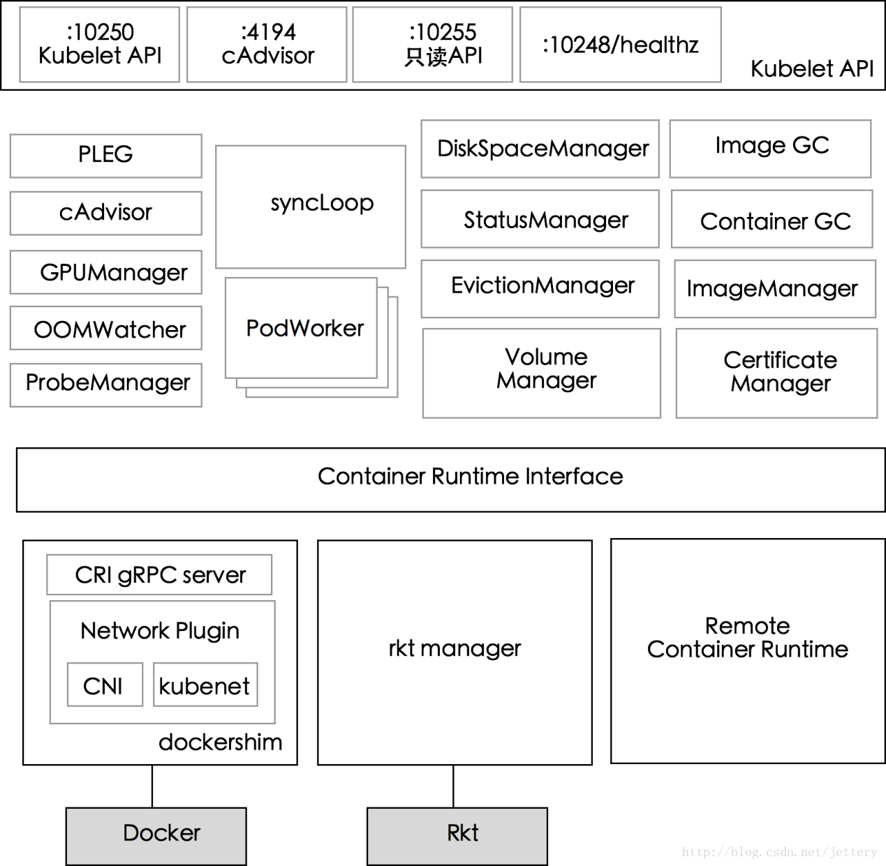

# Kubelet代码分析
> 在Kubernetes集群中，每个Node节点（又称Minion）上都会启动一个Kubelet服务进行。
> 该进程用于处理Master节点下发到本节点的任务，管理Pod及Pod中的容器。
> 每个Kubelet进程会在API Server上注册节点自身信息，定期向Master节点汇报节点资源的使用情况，并通过cAdvise监控容器和节点资源。

- kubelet 主要功能：

1. pod 管理：kubelet 定期从所监听的数据源获取节点上 pod/container 的期望状态（运行什么容器、运行的副本数量、网络或者存储如何配置等等），并调用对应的容器平台接口达到这个状态。

2. 容器健康检查：kubelet 创建了容器之后还要查看容器是否正常运行，如果容器运行出错，就要根据 pod 设置的重启策略进行处理。

3. 容器监控：kubelet 会监控所在节点的资源使用情况，并定时向 master 报告，资源使用数据都是通过 cAdvisor 获取的。知道整个集群所有节点的资源情况，对于 pod 的调度和正常运行至关重要。


kubelet 默认监听四个端口，分别为 10250 、10255、10248、4194。
```
LISTEN     0      128          *:10250                    *:*                   users:(("kubelet",pid=48500,fd=28))
LISTEN     0      128          *:10255                    *:*                   users:(("kubelet",pid=48500,fd=26))
LISTEN     0      128          *:4194                     *:*                   users:(("kubelet",pid=48500,fd=13))
LISTEN     0      128    127.0.0.1:10248                    *:*                   users:(("kubelet",pid=48500,fd=23))
```

  - 10250（kubelet API）：kubelet server 与 apiserver 通信的端口，定期请求 apiserver 获取自己所应当处理的任务，通过该端口可以访问获取 node 资源以及状态。

  - 10248（健康检查端口）：通过访问该端口可以判断 kubelet 是否正常工作, 通过 kubelet 的启动参数 --healthz-port 和 --healthz-bind-address 来指定监听的地址和端口。
 ```
 $ curl http://127.0.0.1:10248/healthz
ok
 ```
  - 4194（cAdvisor 监听）：kublet 通过该端口可以获取到该节点的环境信息以及 node 上运行的容器状态等内容，访问 http://localhost:4194 可以看到 cAdvisor 的管理界面,通过 kubelet 的启动参数 --cadvisor-port 可以指定启动的端口。
```
 $ curl  http://127.0.0.1:4194/metrics
```
  - 10255 （readonly API）：提供了 pod 和 node 的信息，接口以只读形式暴露出去，访问该端口不需要认证和鉴权。
```
//  获取 pod 的接口，与 apiserver 的 
// http://127.0.0.1:8080/api/v1/pods?fieldSelector=spec.nodeName=  接口类似
$ curl  http://127.0.0.1:10255/pods
// 节点信息接口,提供磁盘、网络、CPU、内存等信息
$ curl http://127.0.0.1:10255/spec/
```



## 代码入口

Kubelet 的主函数入口在 `cmd/kubelet/kubelet.go`中
```diff
func main() {
	command := app.NewKubeletCommand()

	// kubelet uses a config file and does its own special
	// parsing of flags and that config file. It initializes
	// logging after it is done with that. Therefore it does
	// not use cli.Run like other, simpler commands.
	code := run(command)
	os.Exit(code)
}

func run(command *cobra.Command) int {
	defer logs.FlushLogs()
	rand.Seed(time.Now().UnixNano())

	command.SetGlobalNormalizationFunc(cliflag.WordSepNormalizeFunc)
	if err := command.Execute(); err != nil {
		return 1
	}
	return 0
}
```
